 *Notes*

--------------------------
# Wednesday January 17th
--------------------------

# What problems can algoriths solve?
* #### Managing big data on the internet
    * Search Enginge for findign data

# Why Study Algorithms ?
* #### Algorithm is a technology you should master
    * advacned computer artitecture
    * efficient algoirthms
    * machine learning
    * mobile devices
    * fast networking both wried and wireless
* ##### Consider sorting the list of n = 10^7 numbers as an example
    * #### **Insertion Sort** takes time C1N^2 where c1 is a constant
    * Suppose this is run on a fast computer that can do a numver of instructions
    * Suppose the code is optimized such taht c1 = 2
    (2* (10^7)^2 instructions) = 20000 instructions
* #### **Merge sort** takes time C1N logn where c1 is a constant
    * Considering this running on slow computer it would only take 1163 making it more optimized for the solution

# Friday January 19th

------------------------

# Sorting

* ### Problem of sorting
    * input: an array of numbers
    * Output: a permutation or reordering
        * Example:
            * Input: 8 2 4
            * output: 2 4 8
* ### Why is sorting important
    * sorting can be used to represent important problems and prprocess data for things like travel websites
* ### Sorting Algorithms
    * Insertion, Merge, Quicksort, Heapsort

* # Insertion Sort
*I believe that all of the content and pseudocode has the first index as 1 and not 0**
* https://www.youtube.com/watch?v=JU767SDMDvA&ab_channel=MichaelSambol
    * An efficient algo for sorting a small number of elements
    * **IDEA** similar to sorting a hand of playing cards
        * start with empty left hand and a pile of cards
        * grab from pile with right hand and insert into left hand in correct position with largest num to the right
    * 5 2 4 6 1 3
    * Look at the next position and swap
        * i.e. compare 5 with 2, 2 is less so swap
        * i.e. compare 5 with 4, 4 is less so swap
        * continue until sorted
 #### Psuedcode
    for i = 2n
        key = A[i]
        // insert A[i] int othe sorted subarray A[1:i-1]
        j = i - 1
        while
            J > 0 and A[j] > key
            A[j+i] = A[j]
            j = j - 1
        A[j+1] = key
* ### Why insertion sort works correctly?
    * **Loop invariant**
        * At the start of each iteration of the outer-for loop, the subarray A[1: i-1] consits of the elements orginially in A[1: i-1] but in the sorted order.
    * Need to show three things
        * **Intialization** : true prior to first interation
        * **Maintenance**: true before iteration and remains true before the next iteration
        * **Termination** : loop terminates and invariant shows it's true
* ### Running time analysis
    * denote input size n with T(n)
        * **size of the input n** : short easier to sort
        * **nature of the input** : an already sorted list is easier to sort no shit
    * Time analyzed on RAM model:
        * k-th line of code takes ck time to run where ck is a constant
    * 
    * **Best Case** : array is already sorted so ti = 1 for i = 2,3, ...... n
    * **Worst Case** :  array is in reverse sorted order so ti = i for i  = 2,3, .... n

* ### Worst-cast running time
    *we'll focus on worst*
    * It gives upper bound providing a runtime **gauruntee* certified by professor sun
    * Worst happens a lot i.e. searching for info on database that doesn't exist
    * The *average case* i.e. one that is half sorted half not is usually just as bad
* ###  Order of Growth
    * We simplify our runtime
    * we remove the leadin term i.e 3* O(n) we remove the 3 it's inconsequential in the long run
    * O(n) faster than O(n^2) regardless of numerical coefficient

--------------------------
# Wenesday January 24th
--------------------------
# More sorting algos (merge sort)
--------------------------

* ## Divide and Conquer
    * Recursion and three problem sets
        * *Divide*
            * The problem into further subproblems smaller than instances of the same problem
        * *Conquer*
            * subproblems are solved recursively
        * *Combine*
            * combine subsolutions to original problem
* ## Merge sort
    * uses divide and conquer
        * 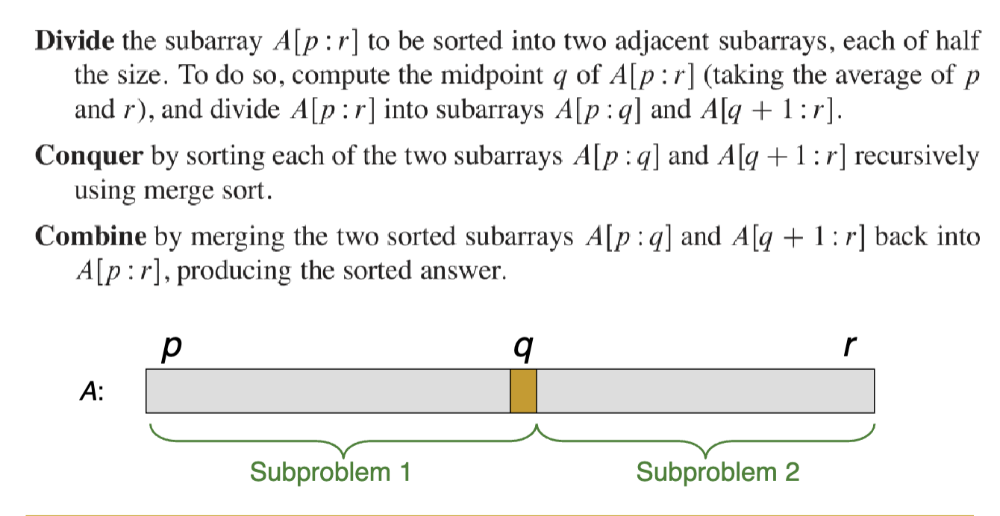
        * 
        * merge sort breaks up and array into two partitions, and then each two into two, etc. until there is only one left in each partition
        * next each element is compared against the first element of the other subarray and so on until it is reorganized in order.

* we ignore second term to get run time.
## SUMMARY
    Insertion Sort: O(n^2)
    Merge Sort: O(n log n)

    Insertion sort is **asymptotically** (ignoring constants) slower than merge sort, ti is faster for sorting small arrays in practice (due to its smaller constant factors)
    Insertion sort is used when there are sufficently small partitions from merge

--------------------------
# Friday January 26th
--------------------------
# Asymptotic Notations
--------------------------
*Asymptotic efficiency* is the worst case running time where the input size in the limit (where higher order dominates and lower order are less relevant)
### O-Notation
* characterizes an upper bound on the asymptotic behavior of the function
* *grows no faster than a certain rate* (again based on highest order)
* ex: f(x) = 7x^3 + 2x^2 + 3 ===> is O(n^3)
### Ω-notation
* Ω-notation characterizes a *lower bound* as the asyptotic  behavior of the function
* the function grows **as least as fast as** a certain rate
* also based on highesdt order
* 𝑓(𝑛) = 7𝑛3 + 100𝑛2 − 20𝑛 + 6 is Ω(𝑛3), since the highest-order term 7𝑛3 grows at least as fast as 𝑛3
### Θ-notation
* is a **tight bound**
* function grows **precisely** at a certain rate
* again based on highest order
* 𝑓(𝑛) = 7𝑛3 + 100𝑛2 − 20𝑛 + 6 is both 𝑂 𝑛3 and Ω(𝑛3), so it is also Θ(𝑛3).
* Note: If a function is both 𝑂(𝑓(𝑛)) and Ω(𝑓(𝑛)), then the function is Θ(𝑓(𝑛)).
* proof for insertion sort is **IN THE SLIDES**

##### Insertion sort
* Since INSERTION-SORT has a worst-case running time that is both 𝑂(𝑛2) and Ω(𝑛2), we can conclude that its worst-case running time is Θ(𝑛2).

#### O-notation proof and other content
**CHECK SLIDES OFR FORMAL IMAGES AND EXAMPLES OF NOTATIONS**
* 
* other proofs are similar to this one
* O f(n) is less than cg(n)
* Ω f(n) is more than cg(n)
* Θ f(n) is sandwiched between c1g(n) and c2g(n)

--------------------------
# Monday January 29th
--------------------------
# Asymptotic Notations
--------------------------
* *Need to be careful when using asymptotic notation to be the most precise that you can be*
* You can say: The worst-case running time for insertion sort is 𝑂(𝑛2), Ω(𝑛2), and Θ(𝑛2); all are correct. Prefer to say 𝛩(𝑛2) here, since it’s the most precise.
* You can say: The best-case running time for insertion sort is 𝑂(𝑛), Ω(𝑛), and Θ 𝑛 . Prefer 𝛩 𝑛 , again more precise.
* You cannot say: The running time for insertion sort is Θ(𝑛2), with “worst-case” omitted. Omitting the case means making a blanket statement that covers all cases, and insertion sort does not run in Θ(𝑛2) time in all cases.
* You can say: The running time for insertion sort is 𝑂(𝑛2), or that it’s Ω(𝑛), because these asymptotic running times are true for all cases.

### o-notation
* **o-notation** : characterizes a strict upper bound on the asymptotic behavior of the function
    * **O-Notation** : can be considered <=
        * 𝑓 𝑛 = 𝑂(𝑔(𝑛)): function 𝑓 𝑛 grows no faster than 𝑔(n)
    * **o-Notation** : can be considered <
        * 𝑓 𝑛 = 𝑂(𝑔(𝑛)): function 𝑓(𝑛) grows strictly slower than 𝑔(n)
    * 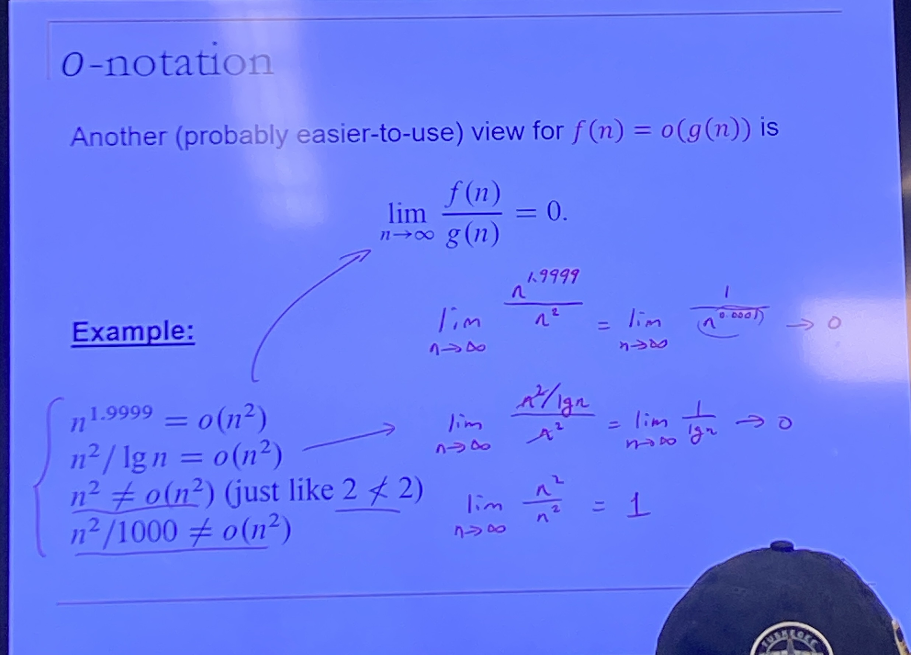
### 𝜔-notation
* **𝜔-notation** : characterizes a strict upper bound on the asymptotic behavior of the function
    * **Ω -Notation** : can be considered >=
        * 𝑓 𝑛 = 𝑂(𝑔(𝑛)): function 𝑓 𝑛 grows at least as fast as 𝑔(n)
    * **𝜔-Notation** : can be considered >
        * 𝑓 𝑛 = 𝑂(𝑔(𝑛)): function 𝑓(𝑛) grows strictly faster than 𝑔(n)
    * 
### Comparison of functions
* transitive
* symmetric
* reflexive
* transpose symmetry

### dichotomy property
* comparison between two functions f and g and the comparison of two real numbers
* 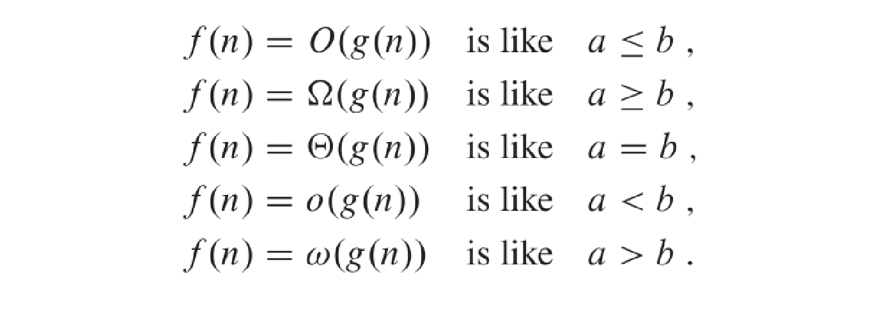
* for real numbers either a <= b or a >= b

### Growth of functions
* 
* base of a log doesnt matter asymptotically but the base of exponential and the degree of a polynomail or polylog do matter asymptotically
* 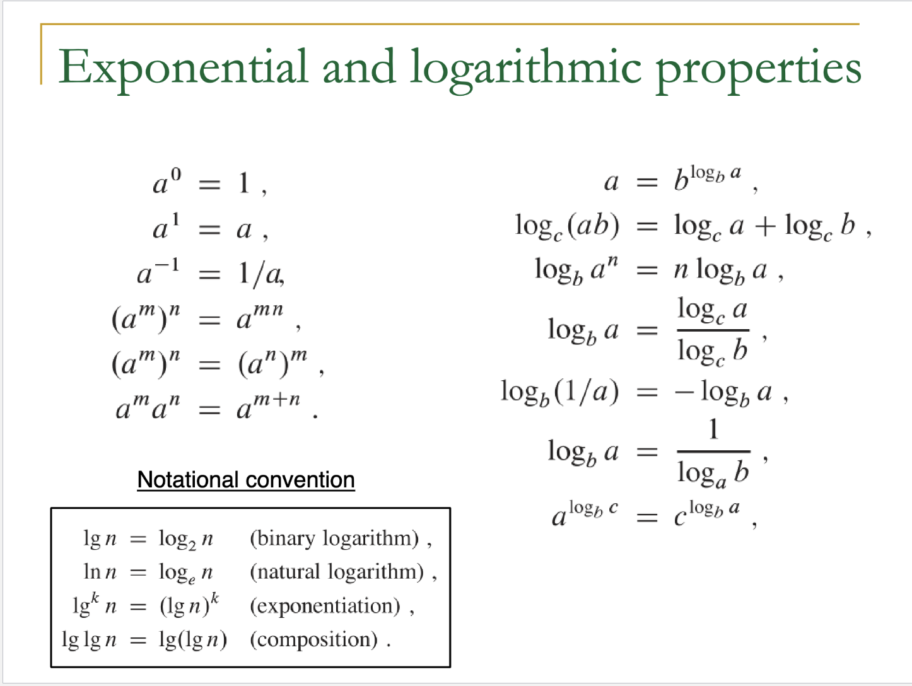
* lg = log base 2
* 2^lg(n) = n
* (sqrt(2))^lg(n) = sqrt(n)
**order of growth highest to lowest**
* n! e^n 2^n n^3 n^2 nlg(n) { 2^lgn n } (sqrt(2))^lgn) lg^2(n)

--------------------------
# Wednesday January 31st
--------------------------
# Recurrence
--------------------------

### Conventions
* dont need to state explicit base cases
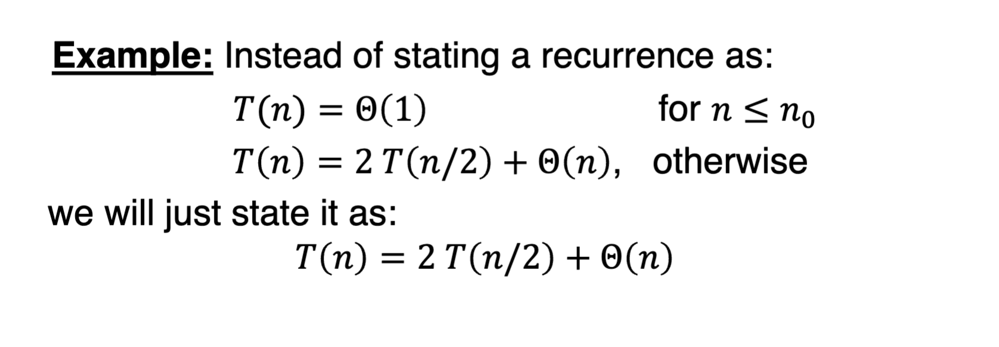
* state asymptotic notaiton without the ceilings and floors

#### Four methods for solving recurrences
* **substitution method** : guess the soltuiuonthen use induction to prove the solution is correct
* **recursion-tree method** : Draw out a recursion tree,
determine the cost at each level, and sum them up. This is useful for understanding of the recurrence and coming up with a guess for the substitution method
* **Master Method** :  A cookbook method for solving recurrence of the form 𝑇(𝑛) = 𝑎𝑇(𝑛/𝑏) + 𝑓(𝑛), where 𝑎 > 0 and 𝑏 > 1 are constants, subject to certain conditions
* PROOFS on slides (idk if we'll need to know those he said at the beginning that we didn't
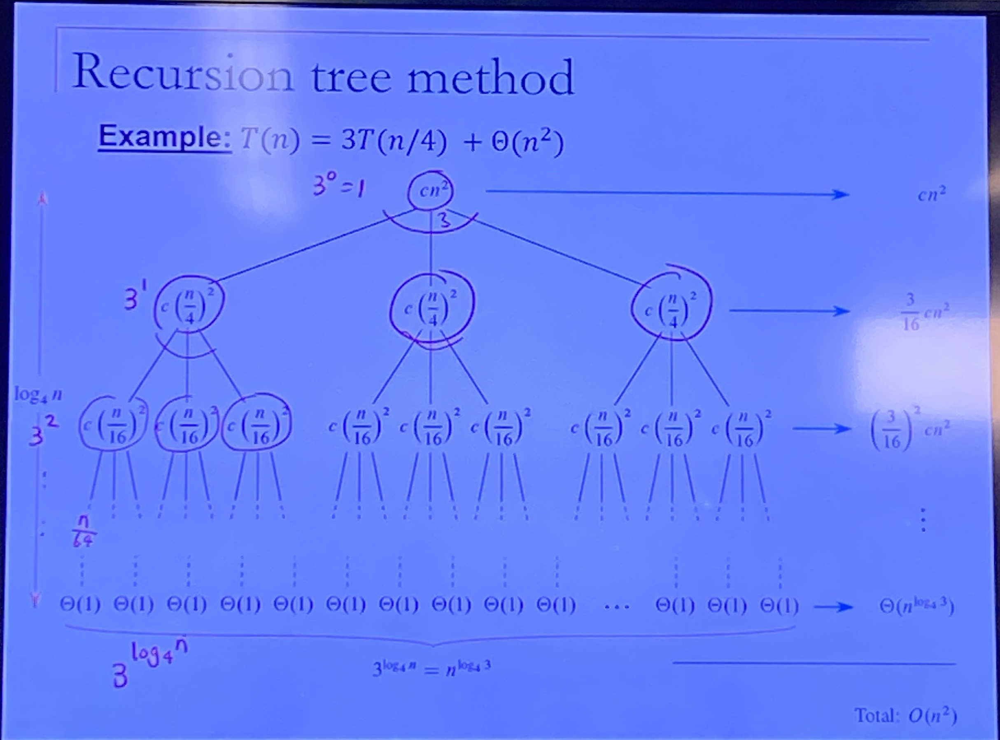
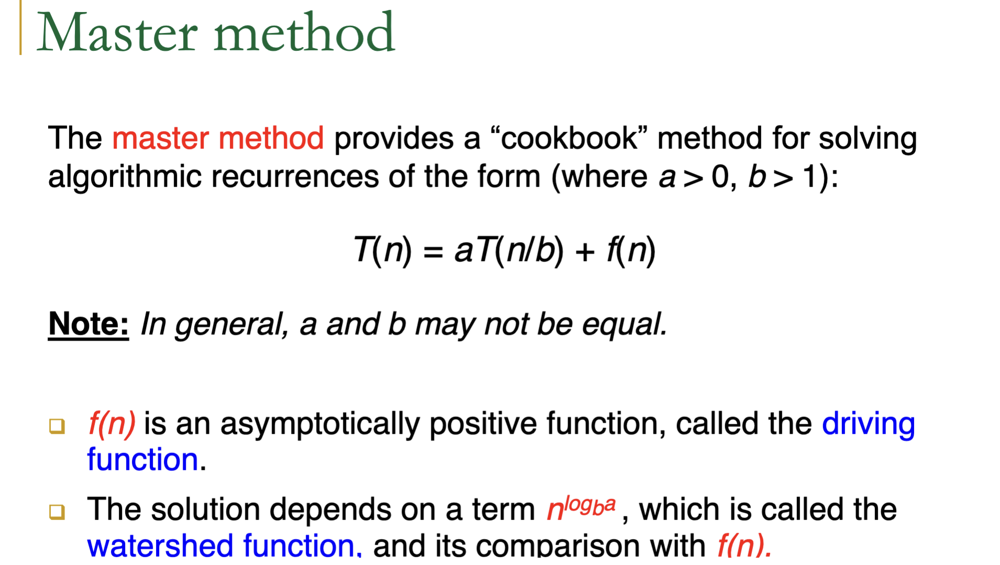
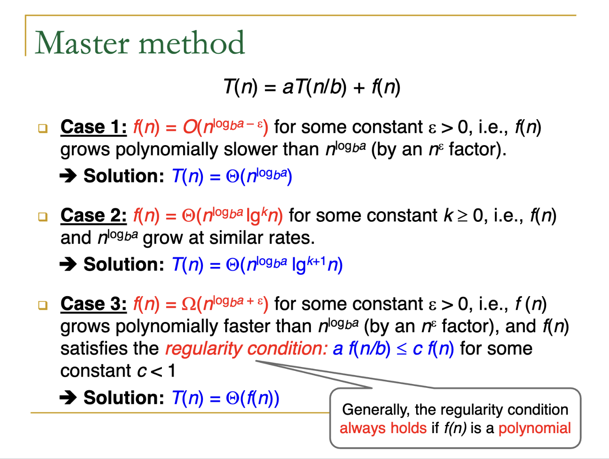
# THIS IS TEST CONTENT ^^^^^^^
## MEMORIZE THE THREE FORMS ANALYZE THE CASE AND APPLY IT DIRECTLY
    for the master method the driving function is the f(n) term and the watershed function is the n^(logb(a)) fuction ==> in each of the cass you are comparing the watershed function to the driving function
    the final answer is givin by the f(n) however, you have to increase the polylog function by one
    if f(n) = n^2/(lg(n)) then the power of the lg function is -1 so case 2 doesnt apply and furhter the master method doesnt apply

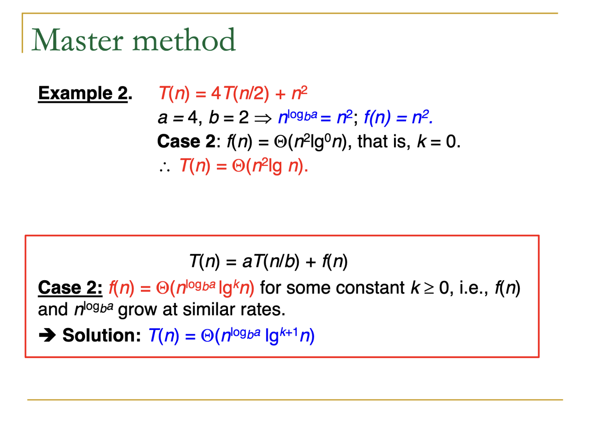
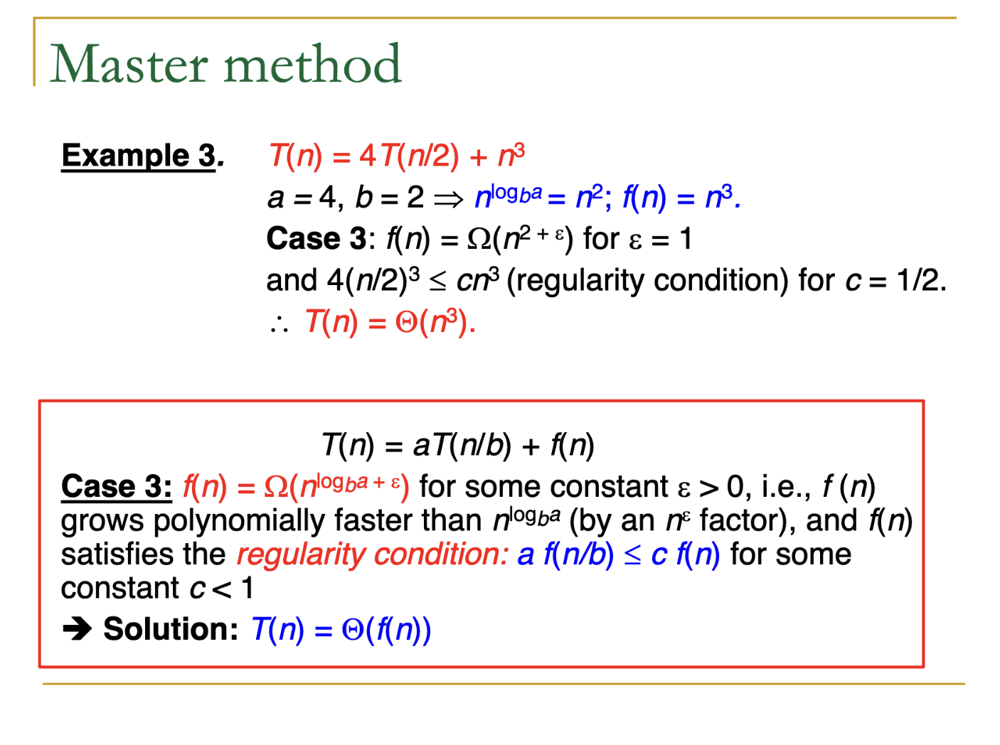
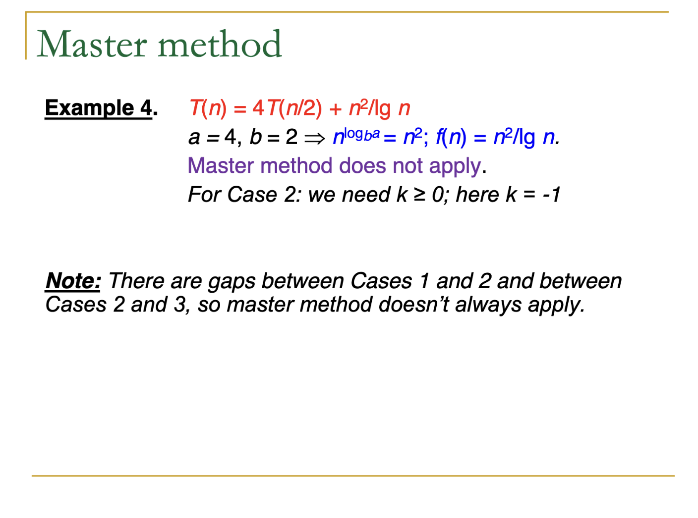

--------------------------
# Friday Feburary 2nd
--------------------------
# Divide and Conquer Algorithms
--------------------------

### Binary Search
1. **Divide** : check middle element
2. **Conquer** : Recursivelt search a subarray (left or right)
3. **Combine** : Trivial (do nothing)
* https://www.youtube.com/watch?v=fDKIpRe8GW4&ab_channel=MichaelSambol

### Matrix Multiplication
    matrixMultiply(A,B,C,n)
        for i = 1 to n
            for j = 1 to n
                for k = 1 to n
                    cij = cij + aik * bkj
* triple for loop is the algorithm
* Θ(n^3)
* **divide and conquer algorithm for Matrix Multiplication**
    * divide a nxn matrix into 2x2 matrix of (n/2) x (n/2) submatrices:
    * 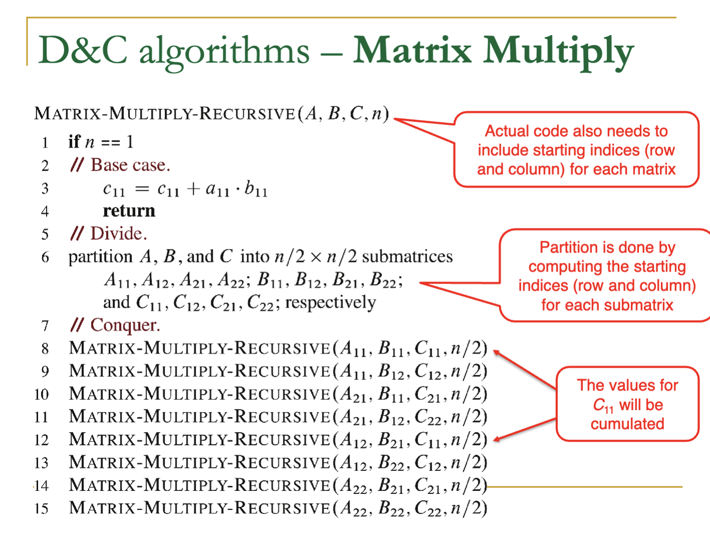
    * Recurrence: T(n) = 8 T(n/2) + /theta(1)
    * because of 8 submatrix multiplications and submatrix size of n/2 and adding 1 for dividing matries
    * with the **master method** using case 1 we know the runtime is /theta(n^3)
* **Strassen's Algorithm**
    * *idea* : reduce submatrix multiplications by using more submatrix additions because thye cost less compute power
    * similar to --> x^2 + y^2 = (x-y)(x+y)
    * Recurrence: T(n) = 7 T(n/2) + /theta(n^2)
    * watershed = n^2.807 f(n) = n^2
    * bigtheta(n^2.807)
---------------
# **Monday Feburary 5th**
---------------
# **Randomized Algorithms**
---------------

### The hiring problem
* Hiring a new person you are given one candidate each day for a total of *n* days (*n candidates*)
* If you hire you must fire the current person
* 
* strategy is to hire the best candidate seen so far that is better than the current employee which you must fire
* becaue you must have someone hired you will hire the first candidate interviewied.
* 
    * There are n candidates total and you hire m of them (m <= n)
    * O(ci(n) + ch(m))
        * The **total interview** cost ci(n) is fixed (because n is)
        * **hiring cost** is dependent on m
        * 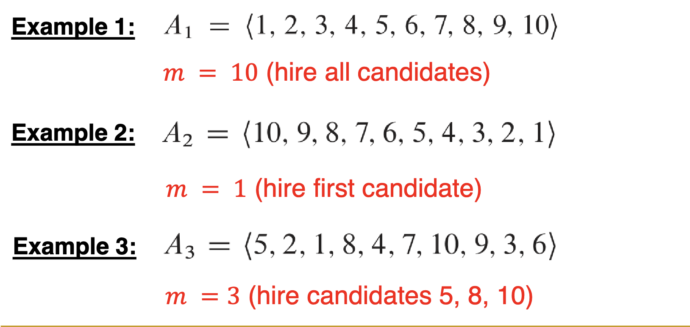
        * You take the higher level interviewee.
    * **Worst case**
        * In reverse order so you hire all of the people (ch(n))
    * **Probabilistic Analysis**
        * make assumptions about the distributions of the input by using the average over all possible inputs (**average-case run time**)
        * all n! permutations of their ranks (1,2,3,....,4) are equally likely
        * 
    * **Indicator Random Variable**
        * Provides a convenient method for converting between Probabilities(Pr) and expectations (E).
        * 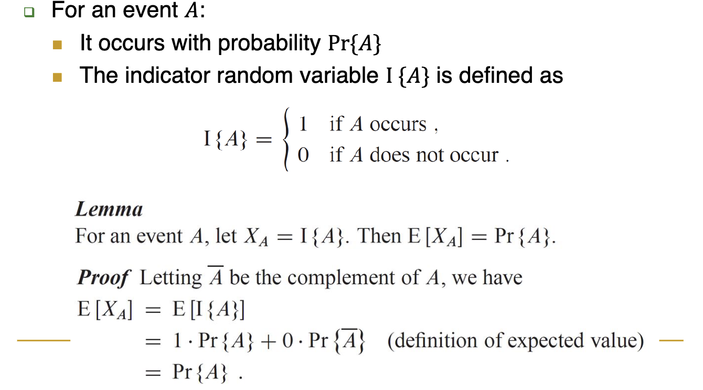
    * **Coin Flip Problem**
        * 
    * **Back to the Hiring Problem**
        * **What is the probability that candidate i is hired?**
            * For candidate i = 1,2,....,n define Xi = I{candidate is hired} as an indicator random variable
            * E[Xi] = Pr{Candidide i is hired} = 1/i
            * this means 10 candidates => 1/10 chance of gettign hired
            * The first i candidates are all equally likely to be the best candidate
        * 
    * **From Probalisitic Analysis to Randomized Algorithm**
        * **Probablisitc Analysis**
            * Assumesk knowledge of distribution input
        * **Randomized Algorithm**
            * Uses randomization to enforce a distribution on the inputs inside the algorithm instead of in the input
            * for psuedo start with randomly permute (change the order) the list of candidates
            * random permutations ensure that it is not the worst case
    *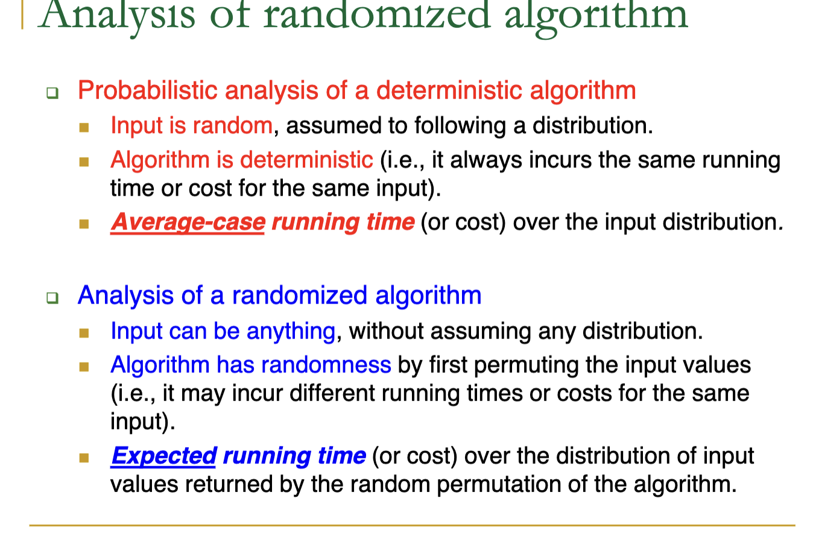

---------------
# **Wednesday Feburary 7th**
---------------
# **Quick Sort**
---------------
### Mood for this lecture
 
### We grilling some mf meats

### Quciksort
* **Quicksort** is a sorting algo that uses divide and conquer
* This 4 minute video prob better than the whole lecture
https://www.youtube.com/watch?v=Hoixgm4-P4M&ab_channel=MichaelSambol
* Quicksort uses a **PARTITION** that selects a **pivot** value **THE LAST VALUE** and rearranges the elements on either side of the partition recursively
    * 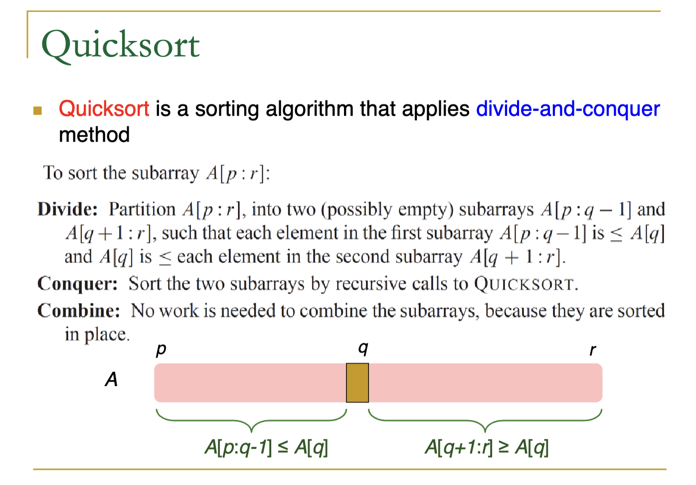
* **Worst Case Runtime**
    * The partitioning is **completely unbalanced**
    * each partition has 0 on one side and n-1 elements on the other
    * 
    * /theta(n^2)
* **Best Case Runtime**
    * The partitioning is **completely balanced**
    * each partiion has roughly n/2 elements
    * 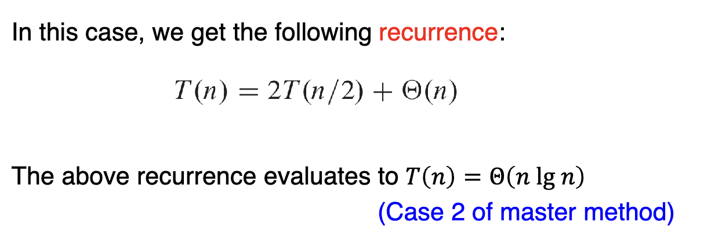
    * /theta(nlgn) ---> Case #2 of the master method
* **Average Case Runtime**
* **AVERAGE**
    * much closer to the best case
    * 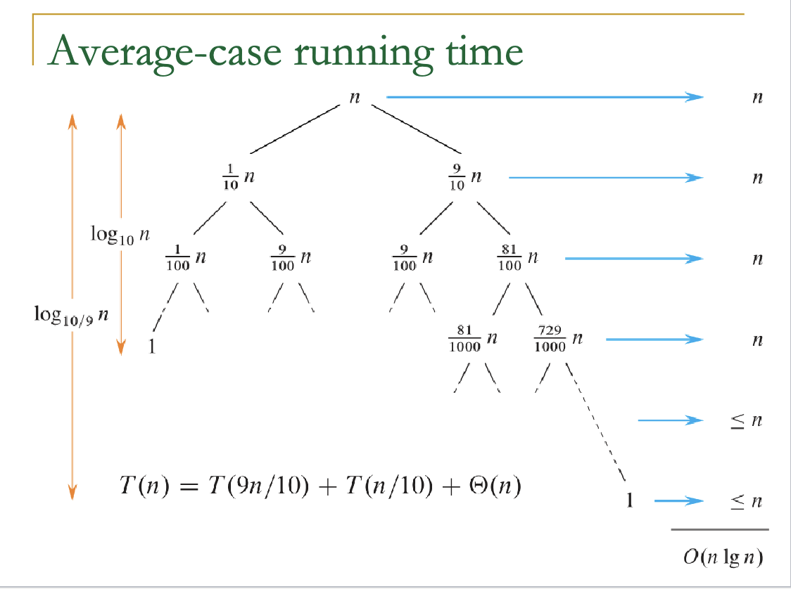
    * Any split of **constant proportionality** yields a runnign time of O(nlgn) the ratio only affects the constant which has no affect asymptotically i.e. /theta

### Randomized Quicksort
* To enforce an input distribution, we can again randomize the algorithm, and get the same expected running time 𝑂 𝑛 lg 𝑛

---------------
# **Friday Feburary 9th**
---------------
# **Heapsort**
---------------
    Mood for todays heaps

### Heap
* **Binary Heap** data structure is an array object which can also be viewed as *(nearly) complete binary tree*
    * Each node of the tree corresponds to an element of the array
    * It is filled on all levels except the lowest level
    * lowest level is filled from left to right
    * 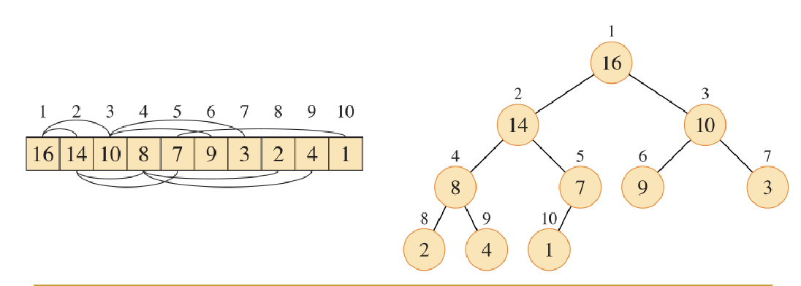
* **Indexes**
    * Parent(i) = i//2
    * Left(i) = 2i
    * Right(i) = 2i+1
* **Array View**
    * Array is represneted as A[1:n] with n elements
* **Heap View**
    * Heap has an attribute A.heap-size which repreenst the number of valid elements
    * 0 < A.heap-size <= n
* **Height**
    * for mostly complete ---> Θ(lg 𝑛)
    * 
* **Mn Max Heaps**
    * 
* **Max Heapify**
    * Recursive procedure that maitains the amx-heap rpoperty for a heap A on index i by:
        * Binary trees rooated at Left(i) and right(i) the two childern off of the root
        * But A[i] the root may be smaller than its children thus violating the max heap property
        * 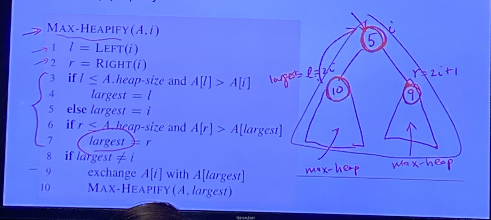
    * 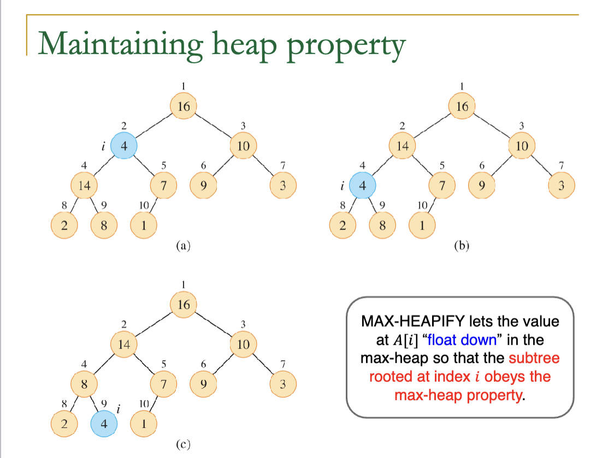
    * **Runtime**
        * O (lgn)
        * *because it has a height of h and h =lgn but its big O because you might not always go down to a leaf*
* **Building a Heap**
    * **Max Heapify** builds a heap from the bottom up
    * 
    * You start at the n//2 index because that is where the last parent node would be the higher indexes wouldnt have children (in this scenario index 5)
### Heap Sort
* 

### Why is heapsort correct?
* 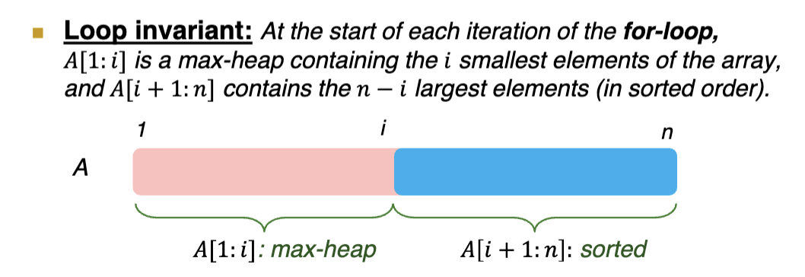
