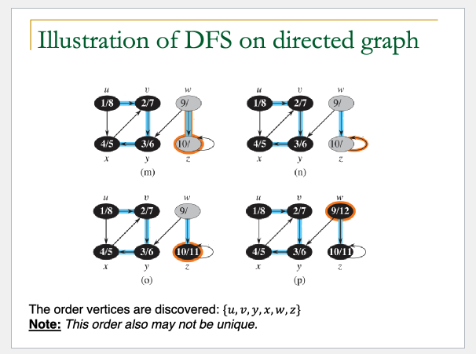
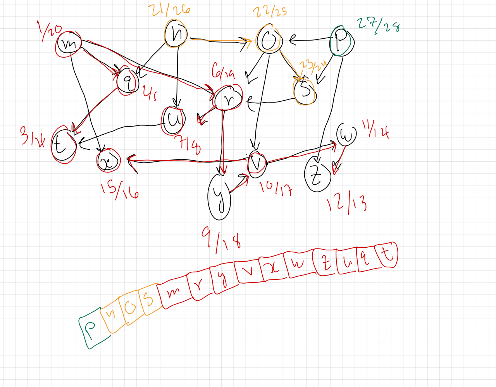
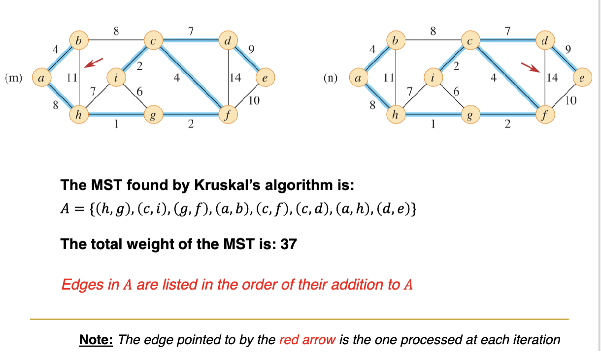
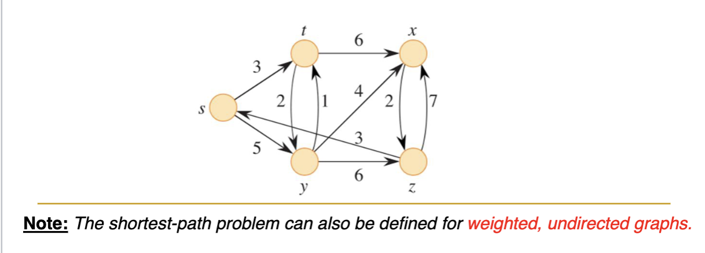
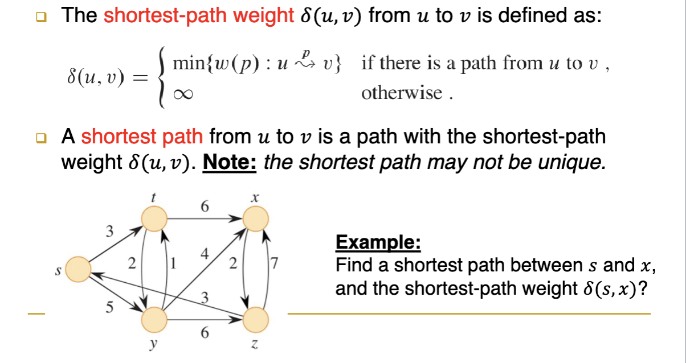
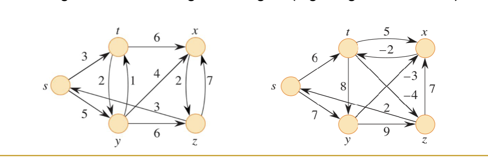
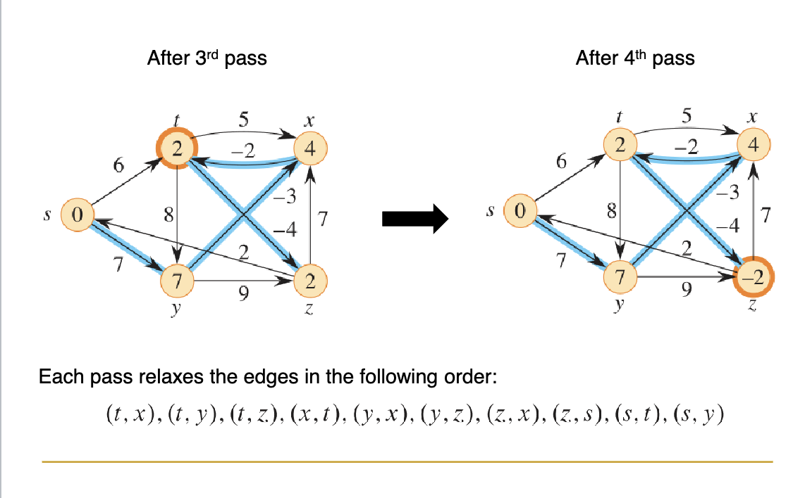
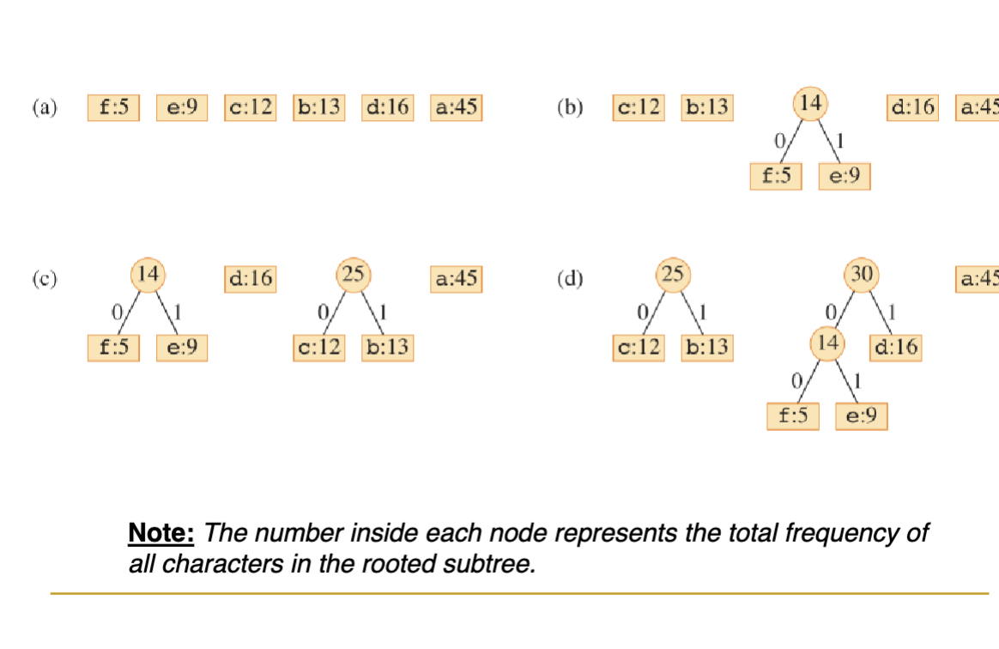
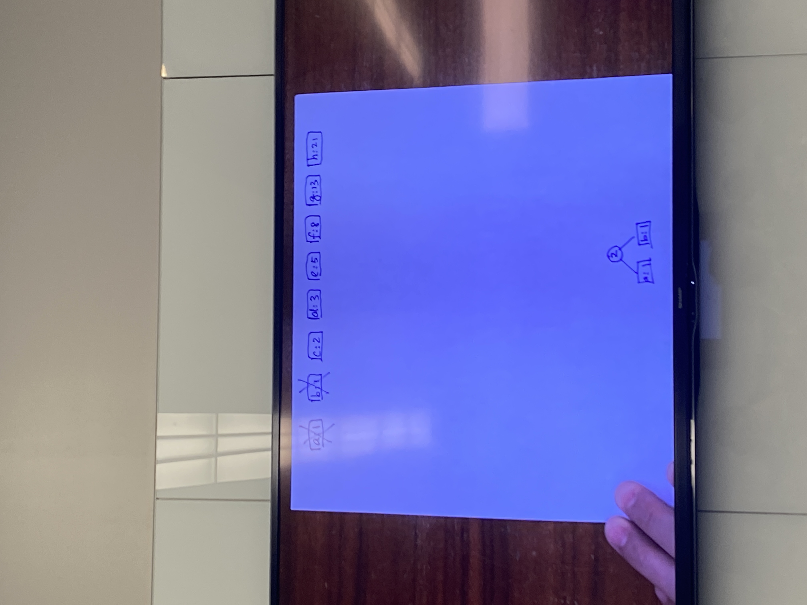

* 
---------------
# **Monday March 18th**
---------------
# **Disjoint Sets and Graphs**
---------------

### Disjoint Sets
* Dynamic sets aer collection of objects i.e. S = {3,2,5,8,9
* Two sets are **disjoint** if they don't share objects in common i.e. A = {3,2,9} B = {1,5,6}
* A disjoin-set (aka union-find) data structure maintains a collection of disjoint sets.
Each set is identified by a *representative* whcih is some member of the set

* *Examples*
    * A = {3,2,8,9} representative -> 3
    * B = {1,5,6} representative -> 5
    * C = {7,4,11} representative -> 11

### Disjoint set Operations
* Make-set(x) : creeates a new set with only member and thus representative is x if x not in another set
* union(x,y) : merges two sets containing x and y respectively
* find-set(x) : returns the representative o teh set containing element x

### Scenario
* intially call make-set n times to have n singleton sets
* Then m operatiosn of union and find-set are performed
    * union reduces the number of sets by 1 among m operations i.e. at most n -1 union operations
    * watn to know runing time of m operations

### Applications of disjoint sets
* finding *connected components* of an undirected graph
* finding *minimum spaning tree* of a weighted graph
* 

### Representing Disjoint sets
* linked lists
* trees

### Linked-list Representation
* Each set is represented by its own linked list with all elements of the set
    * *Set Object* has two attributes
        * head pointer, tail pointer
    * *pointer attributes* in each element of the list
        * next pointer (NIL if last), set pointer (back to the set)
    * The **representative** of the set is the *first element* in the list
    * 

* **MAKE-SET(X)**
    * creates a new linked list with one elmenet x
    * *running time* : Θ(1)

* **FIND-SET(X)**
    * Follws pointer from x to set object and retunrs obj that head points to
    * *running time* : Θ(1)
    * 

* **UNION(x,y)**
    * Appen y's list fo the end of x's list and update pointers
    * *running time* : Θ(|𝑆2|), where 𝑆2 is the set containing 𝑦 (due to
updating the set pointers of all elements in 𝑆2)
    * 

* **simple UNION(x,y)**
    * always appends the second element y's list to the first element x's list
    * each sequence m of UNION and FIND-SET opeations has a worst case n-1 UNIONs and each appends the longer list to the shorter list
    * Running time : Θ(𝑛^2)
    * 
    * *TOTAL RUNNING TIME* of m operations O(m + n^2)
### Weighted Union

* **weighted UNION(x,y)
    * appends shorter list to the longer list
    * 
    * *TOTAL RUNNING TIME* : O(m + nlg(n))

### Tree Representation

* *Each set* is representated by a *rooted tree* each node represents one element in the set
    * each element of the set has a *pointer attribute: parent pointer* (which points to its parents in the tree)
    * the *representative* of the set is the **ROOT** of the tree

* **MAKE-SET(x):
    * creates a new tree with only element x
    * run time Θ(1)

* **FIND-SET(x):
    * Follows the parents pointers from x up the tree to the root
    * run time Θ(d) where d is the depth x

* **MAKE-SET(x):
    * Makes the root of second tree point to the root of the first tree
    * run time Θ(max{d1,d2}), where d1 and d2 are the depths of x and y in the two trees, respectively (for findign the roots of the two trees using FIND-SET(x) and FIND-SET(y)

## Simple Union
    always makes the root of the second tree point to the root of the first
* for a seuqnce m *UNION* and *FIND-SET* ops:
    * at worst n-1 UNIONs which makes a lone lien of n nodes
        * total-cost: Θ(n^2) and an average cost of Θ(n) per UNION operation
        * FIND-SET operations result in Θ(n) cost per operation in worst case
## Two heuristics to improve running time : (Union by rank, Path compression)

## Union By Rank
    makes root of tree with smalelr rank point to root of tree with larger rank
* *RANK* of the tree is the height of the tree (more specifically the upper bound on the height of the three)
* MAKE-SET(𝒙): initializes the rank of node 𝑥 to 0
* FIND-SET(𝒙): doesn’t change the rank of node 𝑥
* UNION(𝒙, 𝒚): there are two cases.

## Case 1

## Case 2

## Union By Rank Running Time

* Heuristic can be used makes root of tree with less nodes point to root of tree with more nodes
* Both union by size and rnion by rank work well in theory
* in practice its easier to maintain union by rank

## Path Compression
    Each node along the path up to the root point to the root (by updating parent pointers)
* NOTE: Path compression relies on FIND-SET so it is also applied in UNION operations

## Psuedo Code for Disjoint Set Algorithm

---------------
# **Monday March 18th**
---------------
# **Graphs**
---------------

## Graphs
    Alg structure representing a set of objects where some pairs of the objbects are connected
* A graph is denoted G = (V, E)
    * V is the vertex set
        * contains set of objects (called vertices or nodes)
    * E is the edge set
        * contains all connections (edges)

* Graph problems are pervasive in cs
    * When characterizing the running time of a graph algorithm on a given graph G = (V, E), we usually measure the size of the input in terms of two parameters: the number of vertices |V| and the number of edges |E|.

## Examples
* Social network of people (think connection web)
    
* Transport Network
    

## Directed Graphs
    Sometimes called digraph
* Edge set E contains a set of directed edges
    * (u,v) is an edge whos direction goes form vertex u to vertex v
    * (u,v) and (v,u) are different edges
    * Self-loops (edges from a vertex to iteself) are possible e.g. (u,u)

## Undirected Graphs
* In an undirected graph, the edge set E contains a set of undirected edges.
* (u, v) is an edge between vertices u and v, and it is the same as (v, u), i.e., direction doesn’t matter.
* We don’t allow self-loops in undirected graphs, so every edge consists of two distinct vertices.

# Graph Terminology

## Adjacency
* Given an edge (u, v) in a graph, we say that vertex u is adjacent to vertex v.
    * When the graph is undirected, the adjacency relation is symmetric.
    * In left figure: vertex 1 is adjacent to vertex 2, and vice versa.
    * When the graph is directed, the adjacency relation is not necessarily symmetric.
    * In right figure: vertex 1 is adjacent to vertex 2, but not vice versa.
    

## Degree
* The degree of a vertex is the number of edges connecting it from/to other vertices in the graph.
    * When the graph is undirected, the degree is simply the # edges incident on the vertex.
    * In left figure: vertex 2 has degree 2.
    * When the graph is directed, its out-degree is the # edges leaving it, its in-degree is the # edges entering it, and its degree is the sum of the two.
    * In right figure: vertex 2 has in-degree 2, out-degree 3, and degree 5

## Handshaking Lemma
    If a graph 𝐺 = (𝑉, 𝐸) is undirected, then the sum of degrees of all vertices is twice the number of edges, i.e.,

## Representation of Undirected Graphs
    Two ways to represent
* A collection of **adjacency lists**
    * This provides a compact way to represent sparse graphs, i.e., |𝐸| ≪ |𝑉|^2, and it is usually the method of choice.
    * Used for sparse data
    * An array Adj of |𝑉| elements, each representing a vertex of graph and points to a linked list containing all vertices it is adjacent to.
    * For undirected graphs, total lengths of all lists is 2 𝐸 (handshaking lemma)
* An **adjacency matrix**
    * This may be used when the graph is dense, i.e., 𝐸 = Θ(|𝑉|^2), or you want to tell quickly whether there is an edge connecting two given vertices
    * dense data
    * 
## Undirected Graph Image Representation
* 

## Representation of Undirected Graphs
    Two ways to represent
* Adjacency-list Representation:
    * An array Adj of |𝑉| elements, each representing a vertex of graph and points to a linked list containing all vertices it is adjacent to.
    * For directed graphs, total lengths of all lists is 𝐸
* Adjacency-matrix Representation:

## Storage Requirement
    *Note*: In (and only in) asymptotic notations, a common convention to describe graph parameters is to simplify |𝑉| as 𝑉, and |𝐸| as 𝐸. Thus, instead of writing Θ(|𝑉| + |𝐸|), we write Θ(𝑉 + 𝐸).

## Weighted Graphs
    (u,v) has an associated weight w
* *Adjacency-list*
    * Each element of the list sotres a weight w attribute
* *Adjacency-matrix*
    * Each element of the list sotres a weight w attribute instead of 1/0 (if two vertices are not adjacent their edge wieght is infinity)

## Graph Search
* Searching a graph means systematically following the edges of the graph to visit all the vertices of the graph.
* A graph-searching algorithm can discover the structure of a graph. Many other graph algorithms first use graph searching to obtain this structural information.
* We will discuss two important graph-search algorithms:
    * Breadth-first search (BFS)
    * Depth-first search (DFS)
* Applications of graph search:
    * BFS’s idea is used as archetype for minimum-spanning tree and shortest-path algorithms of weighted graphs.
    * DFS can be used to perform topological sort and finding strongly connected components of directed graphs.

## Breadth-first search (BFS)
* Given a graph G = (V,E) and a distinguished source vertex s (chosen arbitrarily) breadth-first saerch (BFS)
    * Explores edges G to find vertex v that is reachable from s
* Computes the distance of source vertex s to every vertex v in the graph, where the distance means the smallest number of edges needed to go from s to v.

## Idea of BFS
    expands "frontier" between discovered vertices and undiscovered vertices
* Vertex are discovered in waves emanting from the source vertex until all vertices we are discovered
    1. wave: all vertices with distance 1 from s
    2. 2nd wave: all vertices with distance 2 from s
* BFS uses a singel FIFO queue Q to keep track of the frontier of the waves
* 

---------------
# **Monday March 25th**
---------------
# **Graphs Continued**
---------------
Read this article
    https://www.geeksforgeeks.org/breadth-first-search-or-bfs-for-a-graph/

## How BFS Works - vertex colors
    During search, BFS uses 3 colors to indicate the progress of each vertex in the graph
* **WHITE**
    * Vertex is undiscovered
        * all verticies start white
* **GRAY**
    * discovered for the first time i.e. the vertiex is in the "frontier" of search
        * vertex color is chagned from whtie to gray
        * vertex is enqueued into FIFO Queue Q
* **BLACK**
    * Behind the "frontier" of search
        * happens when the vertex is dequeued from Q
        * followed by discovering all of its neighbors
        * vertex's color is then chagned from gray to black

## How BFS Works - attributes
    when BFS discovers a white vertex v for the first time from a gray vertex u we say u is the predecessor or parent of v
* BFS maintains 3 attributes for vertex vs
    * v.color: (intiially WHITE)
    * v.d : distance from source vertex s to vertex v (initially infinity)
    * v.pi (v.𝜋) : predecessor/parent of vertex v (intially NIL)
* When v is discovered fro the first time from u, we have:
    * v.color = GRAY
    * v.d = u.d + 1
    * v.pi = u
    * 

## Illustration of BFS on undirected graph

## Pseudocode of BFS

## Running time of BFS
    Θ(𝑉 + 𝐸)

## Exercise BFS undirected graph

## Depth-first search (DFS)
* While BFS searches in the wave frontier from a source vertex, depth-first search (DFS) starts from any vertex, and searches “deeper” in the graph whenever possible, before backtracking to search for other vertices in the frontier.

## How DFS works
* Like BFS, DFS also uses 3 colors to indicate the progress of each vertex in the graph.
    * WHITE: the vertex is undiscovered yet.
    * GRAY: the vertex is discovered for the first time.
    * BLACK: the vertex is finished, i.e., all of its neighbors in the adjacency list have been completed explored.
* Additionally, DFS maintains 2 timestamps for each vertex 𝑣.
    * 1st timestamp 𝑣.𝑑: records when the vertex 𝑣 is first discovered (thus colored GRAY).
    * 2nd timestamp 𝑣.𝑓: records when the vertex v is finished (thus colored BLACK).
    * we uses the notation on the right in our illustration
    * We should always have: 𝑣.𝑑 < 𝑣.𝑓
    * Why maintain timestamps: they could be used later for other purposes (i.e., in topological sort). 𝑣. 𝑑 / 𝑣. 𝑓

## Illustration of DFS

* check slides 10 Graphds.pdf slide 33/50 for more examples

---------------
# **Wednesday March 27th**
---------------
# **Graphs Continued**
---------------

## Pseudocode of DFS

## Runtime of DFS

## Example Problem

## Path and Cycle in Directed Graph

## Directed Acylic graph (DAG)
* A direced graph with no cycles is called a directed acylci graph (DAG)

## Topological Sort
* A topological sort ofa DAG G = (V, E) is a linear ordering of all its vertices s.t. that if the graph ocntains an edge (u,v) then u appears befroe v in the ordering.
* You can think of a topological sort of a graph as an ordering of its vertices along a horizontal line so that all directed edges go from left to right
* Note:
    * Topological sort is only defined for DAGs. When a directed graph contains a cycle, no linear ordering is possible.
    * Topological sort is different from comparison-based sorting algorithms we studied previously

## Application of Topological Sort
* Can be used to sequence tasks with depdency constraints

## Topological sort via DFS
* DFS can used to preform topoligcal sort of a DAG in Θ(𝑉 + 𝐸) time.

## Example DFS DAG Exercise

## Connected Compmonents

* In an undirected Graph G = (V,E)
    * A vertex 𝑣 is reachable from another vertex 𝑢, if there is a path that goes from 𝑢 to 𝑣.
    * A connected component of 𝐺 is a subset of its vertex set 𝑉, in which all vertices in the subset are reachable from each other.
    * The graph 𝐺 is said to be connected if it has only one connected component, i.e., all vertices of 𝐺 are reachable from each other.
    * 

## Connected Components by graph search
* Method 1 : Graph-searchign algorithms (e.g. BFS, DFS)
    1. In both BFS and DFS, the search starts with some vertex s and discovers all vertices that are reachable from s. These vertices form a connected component of G.
    2. If there are still unexplored vertices left, the algorithm picks another vertex s′ and discovers all vertices reachable from s′. These form another connected component of G.
    3. The process repeats until all connected components are found.
* **RUNNING TIME**
    * This method takes Θ(𝑉 + 𝐸) time.

## Connected components by disjoint sets
* Method 2 : Disjoint-set data structure can also be used to find connected components of a graph G
    * MAKE-SET(𝒙): creates a new set from element 𝑥.
    * UNION(𝒙, 𝒚): merges the two sets containing elements 𝑥 and 𝑦.
    * FIND-SET(𝒙): finds the set containing element 𝑥.
    1. The algorithm makes a new set for each vertex 𝑣 (via MAKE-SET).
    2. For each edge connecting two vertices 𝑢 and 𝑣, if they don’t belong to the same set (via FIND-SET), merge them (via UNION).
    3. Repeat above for all edges to find all sets (connected components).
* Running time: This method takes Θ(𝑉 + 𝛼(𝑉)𝐸) time, where 𝛼 𝑉 ≤ 4 for most practical graphs.
* 

---------------
# **Friday March 29th**
---------------
# **Minimum Spanning Trees**
---------------

## (Free) Tree
* A (free) tree is a graph with the following conditions:
    * *Undirected*: the edges of the graph don’t have directions.
    * *Connected*: the graph has only one connected component.
    * *Acyclic* : there is no cycles in the graph
* IF an undirected acyclic graph is disconnected (i.e. has > 1 connected components) it is a forest

## (Free) Tree Properties
* Any two vertices are connected by a unique simple pathMinSpanTree.png
    * Simple path : a pathw were all vertices in the path are distinct
    * |𝐸| = |𝑉| − 1 (# edges is one less than # vertices)
    * If any existing edge is removed, the resulting graph will be disconnected
    * If any new edge is added between two vertices the resulting graph will contain a cycle

## Spanning Tree
* For a connected, undirected graph 𝐺 = (𝑉, 𝐸), its spanning tree 𝑇 = (𝑉, 𝐴) is a free tree that contains:
    * All the vertices in 𝑉, and
    * A subset 𝐴 of edges in 𝐸, i.e., 𝐴 ⊆ 𝐸.
* 

## Minimum spannign tree (MST)
* A weighted graph is a connected, undirected graph 𝐺 = (𝑉, 𝐸) with a weight function 𝑤(𝑢, 𝑣) that specifies the cost (or weight) of each edge 𝑢, 𝑣 ∈ 𝐸.
* A minimum spanning tree (MST) for a weighted graph 𝐺 = (𝑉, 𝐸) is a spanning tree 𝑇 = (𝑉, 𝐴) of 𝐺 with the least total cost in the set 𝐴 of edges.
* 
* The wegiths of MST: 11, 8, 7, 10
    * 
    * The weight is form the blue edges
## Representing a Minimum Spanning Tree

## Application of MST
* cost effective netwrok design
* Office Locations

## How to find MSTs??
* generic way that grows by adding one edge at a time
* Kruskal's Algorithm
* Prim's Algorithm
* Both are greedy algorithms

## Generic Method
* Generic Method starts with empty tree and grows by adding one "safe edge" at a time
* 

## Safe Edge
    What makes a safe edge?
* 

* during GENERIC-MST procedure an edge (u,v) is "safe" if it meets:
    * i.e. a cut (S,V-S) that respects A (part of the MST found so far)
    * (u,v) is an edge that crosses the cut (S,V-S) and its weight is the minimum among all edges crossing the cut
    * ex: edge (c,d) with weight 7 is safe in the picture above
    * ex: cut that goes throguh a-h b-h and b-c, then a-h and b-c would be safe edges as well
    * ex: d-e is valid safe edge with a cut throguh d-e and f-e
    * ex: i-g is not a safe edge it doesn't respect the blue boundry it would be a cycle
---------------
# **Monday April 1st**
---------------
# **Minimum Spanning Trees Continued**
---------------
https://www.youtube.com/watch?v=71UQH7Pr9kU&ab_channel=MichaelSambol

## Kruskal's Algorithm
    the edge set A at any time contains a forest (collection of trees)
* Intially A is empty adn teh forest has |A| singleton vertices
* Initially, 𝐴 is empty, and the forest contains |𝑉| singleton vertices.
* All edges are processed in increasing order of weight.
* In each iteration, it finds an edge that connects two trees and has the lowest weight. (This edge is guaranteed to be “safe”.)
* The process repeats until all trees are connected ➔ final MST
* 
* 
* 
* 
* 
* A: 1 + 2 + 2 + 4 + 4 +8 + 8 +9 = 37 total weight for the tree

## Implementation of Kruskals Algorithm
    implemented with a disjoin-set data structure
* Using a disjoint-set data structure, where each set represents a tree in the forest, and the trees are gradually merged to form the MST.
* Sorting the set of edges initially in increasing order of weight and processing them one by one
* 

## Runnign time of Kruskal's Algorithm
* 
* have to first sort edges as opposed to not which is similar to connected componenets by disjoint sets
* 
* 

---------------
# **Wednesday April 3rd**
---------------
# **Minimum Spanning Trees Continued**
# *Prim's Algorithm*
---------------

## Prim's Algorithm
    https://www.youtube.com/watch?v=cplfcGZmX7I&ab_channel=MichaelSambol
    PA at anytime always maintains a single tree A which will eventually grow to form the MST
* three starts from arbitry root vertx r
* In each interation, adds to tree A a minimum-wegiht edge that connets the tree ot hte rest of the vetices
    * This edige is gaurunteed to be "safe"
* the process repeats until all vertices are added to the tree
* 
* 
* 
* $ + 8 + 2 +4 + 1 + 1 + 7 + 9 = 37

## Implementation of Prim's ALgorithm
* Algorithm maintains a min-priority queue Q
    * **INSERT**
        * insert a new vertex with a key into the prioity queue Q
    * **EXTRACT-MIN**
        * removes and return a vertex with smallest key
    * **DECREASE-KEY**
        * decreases the value of a vertex's key to a specific new value
    * Runtime : O(lgV) time to implement iwth MIN-HEAP

* Each vertex 𝑣 ∈ 𝑄 has the following attributes:
    * 𝑣.𝑘𝑒𝑦: minimum weight of any edge connecting 𝑣 to a vertex in tree 𝐴 (initially set to 𝑣. 𝑘𝑒𝑦 = ∞ and possibly updated when a neighbor is added to the tree).
    * 𝑣.𝜋: parent of 𝑣 in tree 𝐴 when it is added to the tree (initially set to 𝑣. 𝜋 = 𝑁𝐼𝐿 and updated when added to the tree).

## Psuedocode for Prim's Alg
* 

## Runtime for Prim's Alg
    O(ElgV)
* 
* E is the number of times you do this with maximum time that you incur lg(V)
* Asymptotically the same as that of Kruskal's Algorithm O(ElgE) where E is the same as V
* dense: Prim's
* Sparse: Kruskal's

## Exercise
* 
* 

---------------
# **Data Structures and Algorithms**
---------------
# **Shortest Paths**
---------------

## Shortest Path Problem
    Asks for shortes possible path between >= 2 vertices
* The input is a weighted, directed graph 𝐺 = (𝑉, 𝐸), where each edge 𝑢, 𝑣 ∈ 𝐸 has:
    * a direction that goes from vertex 𝑢 to vertex 𝑣;
    * a weight 𝑤(𝑢, 𝑣) that specifies the cost (or weight) of the edge
* 

## Path Weight
* 
* 
    * in the example path p = <s,y,t,x>
    * Weight w(p) = 5 + 1 + 6 = 12

## Shortest Path

* from arbitray vetexes u to v there could exist no path or multiple paths
* 
    * There are multiple shortest paths they have weight 9

## Application of Shortest Path
* Ex: GPS route planning
* US Road network
    * Each vertex represents an intersection;
    * Each edge represents a road segment between two intersections;
    * Edge weights represent road distances (or time/cost)

## Different Shortest-path Problems
* Single-source shortest paths (SSSP): find a shortest path from a given source vertex 𝑠 ∈ 𝑉 of the graph to every other vertex 𝑣 ∈ 𝑉 of the graph
    * worst asymptotic time the same as single-pair shortest-path (SPSP) problem
        * i.ei solivng SSSP solves SPSP
* All-pairs shortest-paths (APSP)
    * find a shortest path from vertex 𝑢 ∈ 𝑉 to vertex 𝑣 ∈ 𝑉 for everything pair of vertices 𝑢 and 𝑣 in the graph
        * application finding diamteter of network
## Negative Weight Edge
    edges can be negative
* ex money transfers
* 

## Cant a shortest path contain a cycle?
* answer: NO
* lemma:
    * A shortest path from a source vertex 𝑢 to a destination vertex 𝑣 does not contain a cycle, regardless of the total weight of the cycle
* Proof : suppose shortest path p from u to v contains a cycle
    * 1. if the total wiehgt of the cycle is positive -> a cycle cannot exist
    * 2. if the total weight of the cycle is negative -> shortest-path is undefined
    * 3. how about acycle with 0-weight -> a shortet-path should not contain a 0-weight cycle

## Algorithms for SSSP
* We will present three algorithms for the SSSP problem that work for different scenarios.
    * Bellman-Ford algorithm: works in the general case, where the edge weights may be negative and the graphs may contain cycles.
    * DAG-Shortest-Path algorithm: works for the case, where the edge weights may be negative but the graphs do not contain cycles (i.e., DAGs).
    * Dijkstra’s algorithm: works for the case, where the edge weights must be positive, regardless whether the graphs contain cycles or not.
* All three algorithms assume that the graph is represented by adjacency lists.

## Representing SSSP Solution
* 

## Intialization
* In all three algorithms v.d and v.pi wil be fist initialized (as in psuedocode below) and later refined iteratively
* 

## Constructing SSSP Solution
* shortest-path weight of a vertex v is given by v.d
* actual shortest path from the source s to a vertex v is obtained by backtracking the predecessor alues from v to s
* 

## Relaxation
* 

---------------
# **Monday April 8th**
---------------
# **Shortest Paths Continued**
---------------

## Bellman-Ford Algorithm
    https://www.youtube.com/watch?v=obWXjtg0L64&ab_channel=MichaelSambol
* solves general SSSP problem where the edge weights may be negative and the graphs may contain cycles

* The algorithm returns two types of results
    * returns TRUE or FALSE indicating wheather a meaningful solution exists (i.e. TRUE if there aer no negative-weight cycles in the graph and FALSE otherwise)
* If it returns TRUE, it also returns the SSSP solution, i.e., 𝑣. 𝑑 and 𝑣. 𝜋 for each vertex 𝑣 ∈ 𝑉 in the graph
* can also detect negative-weight cycles

## Pseudocode of Bellman-Ford
* 

## Runtime of Bellman-Ford
* 

## Illustration of Bellman-Ford
* Pass 1
    * 
    * (s,t) (s,y)
* Pass 2
    * 
    * (t,x) (t,z)
* Pass 3
    * 
    * (x,t)
* Pass 4
    * 
    * goes s y x t z
    * (t,z)

## Bellman-Ford Example
* 
* 

## Why is Bellman-Ford Correct?
* 
* **Intuition**
* Since any shortest path does not contain cycles, a shortest path from 𝑠 to any vertex 𝑣 goes through ≤ 𝑉 vertices and thus has ≤ 𝑉 − 1 edges
* Since Bellman-Ford relaxes edges in arbitrary order, in the worst case, it takes |𝑉| − 1 passes for the shortest-path weight to propagate correctly to each vertex (in desired order as specified in the path-relaxation property).
* After |𝑉| − 1 passes, if shortest-path weight can still improve, then there exists a negative weight cycle (which could reduce the shortest-path weight indefinitely).
* THis means a negative cycle would continually decrease weight

---------------
# **Wednesday April 10th**
---------------
# **Shortest Paths Continued**
---------------

## DAG-shortest-paths Algorithm
* Solves the SSSP problem for directed acyclic graphs (DAGs i.e. without cycles) but the edge weights can be negative
* Unlike Bellman-Ford that makes |𝑉| − 1 passes of edge relaxations, DAG-shortes paths makes only one pass, thus is more efficient than Bellman-Ford
    1. The algorithm first completes a topoligical sort of vertices
    2. Then performs edge relaxations over the vertices in the topologically sorted order (with just one pass)
* Recall that a topological sort returns a linear ordering of the graph’s vertices such that if the graph contains an edge (𝑢, 𝑣), then 𝑢 appears before 𝑣 in the ordering.

## Pseudocode and Runtime of DAG-s-p Algorithm
    This is an improvement over Bellman-Frod because Θ(𝑉𝐸) time for Bellman ford is greater than Θ(𝑉𝐸) time.
* 
* 

## Example
* 
* 
* 
* 

## Algorithm is correct again because of path-relaxation property

## Dijkstra's Algorithm
    https://www.youtube.com/watch?v=_lHSawdgXpI&ab_channel=MichaelSambol
* Solves SSSP problem for a graph without negative-wegiht edges but the graph could contain cycles.
* More efficient than bellman-ford

## Idea of Dijkstra's Algorithm
* Generalizes **BFS** by emanating "**waves**" from the soruce vertex to all other vertice
* first wave arrives at a vertex a new wave comes from that
* **BFS** can be considered a special case of **Djisktras** **Algorithm** for finding SSS with unit-wegiht wedges
-----------
* **shortest**-**path** to a vertex can be thoguht of as **shortest** **time** for a wave to prpagate
* BFS simply maintains the vertices in a FIFO queue since it takes unit time for a wave to cross an edge
* **Dijkstra**'s **Algorithm** needs to maintain vertices in a **priority** **queue**

## Idea of Dijkstra's Algorithm
* **Dijkstra**’s **algorithm** uses the **priority** **queue** similarly as how Prim’s algorithm (for MST) uses the priority queue.
* At any time:
    * A set 𝑆 contains the vertices whose shortest paths from the source have **already** **been** **determined**.
    * A **min**-**priority** **queue** 𝑄 contains the remaining vertices whose shortest paths from source are yet to be determined. The priority queue 𝑄 is built based on the vertices’ 𝑣. 𝑑 values (i.e., estimate of the shortest-path weights).
* At each step:
    * The algorithm moves the **highest**-**priority** vertex 𝑢 ∈ 𝑄 (i.e., with smallest shortest-path weight) from 𝑄 to 𝑆.
    * It then performs a relaxation for all vertices adjacent to 𝑢 (i.e., emanating a wave from 𝑣)
## Pseudocode of Dijkstra's Algorithm
* 

## Example
* 
* 
* 

## Exercise
* 
* 

## Why is Dijkstra's Algorithm Correct?
* Cna be considered a **greedy** **algorithm** (like PRim's) since ech step it makes a greedy choice moving the **highest** **priority** **vertx** u from Q to S
* Intuitively, if this doesn’t lead to the shortest path for 𝑢, and suppose the shortest path goes through another vertex 𝑣 ∈ 𝑄, then 𝑣 would have a smaller 𝑑 value, i.e., 𝑣. 𝑑 < 𝑢. 𝑑. This implies that 𝑣 would come earlier than 𝑢 in the priority queue, contradicting that 𝑢 has the highest priority

## Summary of SSSP Algorithms
* 

---------------
# **Friday April 10th**
---------------
# **Shortest Paths Continued**
---------------

## Optimization Problems
* 

## Greedy Algorithms
* **Algorigthms** **for** **optimization** **problems** typically go throguh a sequence of steps, where each step makes a choice/decision
* A **greedy** **algorithm** always makes the choice that is the best at each step. That is **locally** **optimal** **choice** in the hope that this choice leads to a **globally** **optimal** **solution**.
* Greedy strategy important algorithmic design paradigm used to solve many **optimization** **problems**

* We’ll consider three problems and present greedy algorithms to solve them optimally.
    * Problem 1: Activity selection
    * Problem 2: Job scheduling
    * Problem 3: Huffman code
* Previously, we also looked at the MST and SSSP problems, and showed that they admit optimal greedy algorithms (i.e., Prim, Kruskal, Dijkstra).
* Note: Greedy algorithms do not always yield optimal solutions, but sometimes they do. (In this course, we’ll focus on the case when greedy algorithms do yield optimal solutions)

## Problem 1: Activity-Selection
* 
* 
* Subset 1a a4 a7 has incompatible activities because activity a4 ends at 7 which is beteen the start and finish of a7

## Greedy Choice
* 

## Greedy Activity Selector
* 

## Illustration
* 

## Why is this greedy choice optimal?
* Theorem. Activity 𝑎1 must be included in some optimal solution (i.e., a maximum-size subset of mutually compatible activities).
* Proof: We prove the theorem using a cut-and-paste argument

## Greedy Choice Matters
* the **optimal** **greedy** **algorithm** described above selects the first **activity** **to** **finish** at each step
* other greedy algorithsm could make **alternative** **greedy** **choices** at each step and they **may** **not** **yield** **optimal** **solutions**

## Exercise
* Argue if the following greedy choices are optimal. If not, provide a counter-example against its optimality.
    * Select the first activity to start at each step.
        * This is not optimal because you would choose a3 a7 a11 which is not four
    * Select the activity with the shortest duration at each step.
        * This is not optimal becuase you could have two large tasks with a smaller task that overlaps them both and then it is no longer optimal
    * Selects the last activity to start at each step.
        * This is an optimal solution
        * If you view the graph upside down you can see that when its upside down its the same as first to start

---------------
# **Monday April 15th**
---------------
# **Greedy Algorithms Continued**
---------------

## Problem 2: Job Scheduling
* 
* 
    * Schedule 2 is the optimal scheduling
    * It elminates wait time as the small jobs finish first and then big jobs can be completed
    * similar to a factorial as ech job is the time of all the jobs before it plus the job itself
## Greedy Choice
### Intuition
* 

## Shortest job first (SJF) algorithm
* 
    * Cmin is what we are looking to optimize

## Why is the greedy choice optimal?
* The shortest job is processed first in an optimal schedule

## Exercises
# **EXAM** **PROBLEM** **THIS** **WILL** **BE** **ON** **THE** **EXAM** **RED** **ALERT**
## Exercise 1: Suppose 𝑛 jobs are given in increasing order of processing time, i.e., 𝑝1 ≤ 𝑝2 ≤ ⋯ ≤ 𝑝𝑛. Give a formula for the minimum total completion time of the jobs.
* np1 + (n-1)p2 + .... + 2pn-1 + pn
* |----| p1
* |----||----| p2
* |----||----||----| p3
* ......
* ............................. |----| pn
* Then you have to sum up all of the terms
*    n
*    Σ (n-j+1)pj
*   j = 1
## Exercise 2:What is an optimal greedy algorithm for maximizingthe total completion time of the jobs?
* THis is just the opposite do the longest job first

# FINAL EXAM INFO
* Time/Venue : May 6 (Monday) , 7:30am - 10:00am , G415 LEEP
* Format: 20 MCQs , 5 Open Questions , (30 points)
* Open Book, Open Note
* NO electronics
* No make-up
* Emphasis on second half 80% from after break 20% from first half of course

---------------
# **Wednesday April 17th**
---------------
# **Greedy Algorithms Continued**
---------------

## Elements of Greedy Algorithms
* Two key elements of greedy algorithm
    * **Greedy**-**choice** **property**: a globally optimal solution contains a locally optimal (greedy) choice.
        * **Example** **1**: For activity selection problem, local greedy choice is the activity with the earliest finish time.
        * **Example** 2: For job scheduling problem, local greedy choice is the job with the shortest processing time.
    * **Optimal** **substructure**: a globally optimal solution contains within it the optimal solution to a subproblem.
        * **Example** **1**: For activity selection problem, the subproblem (with the remaining activities after selecting the first activity) must be selected optimally.
        * **Example** **2**: For job scheduling problem, the subproblem (with the rest of jobs after scheduling the first job) must be scheduled optimally.

## Steps to Design Greedy Algorithms
* 

## Problem 3: Huffman Code (variable free and prefix free)
* 

## Fixed-Length Code
* 

## Variable-Length Code
* 

## Prefix-Free Code
* 

## Code Representation via Binary Trees
* 
* 

## Constructing Huffman Code
* 
* this algorithm is optimal and builds the tree from the bottom up

## Illustration of Huffman's Algorithm
* 
* 

## Psuedocode of Huffman's Algorithm
## and runtime
* 

## Huffman Exercise
* 
* 
* 
* 
* 
* 
* 
* 
* 
