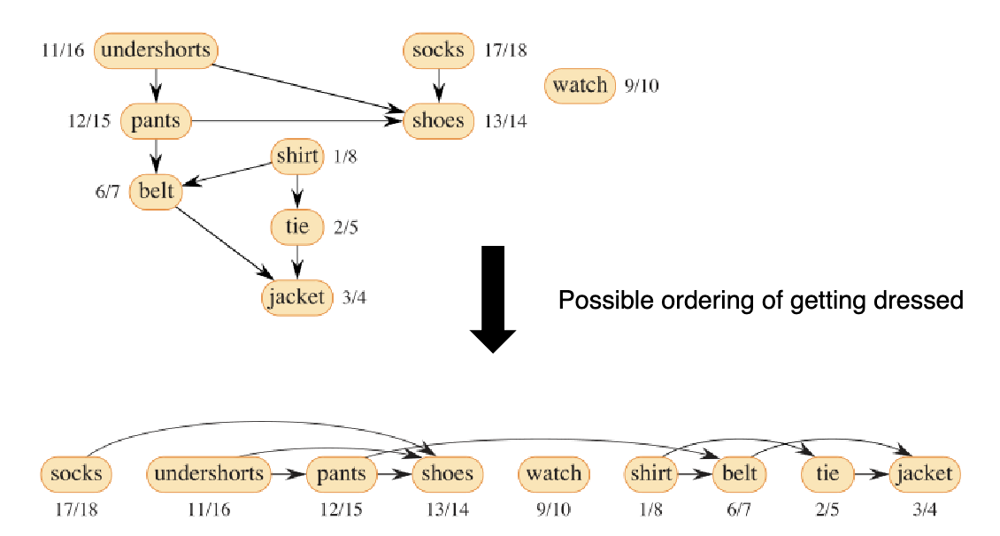

---------------
# **Monday March 18th**
---------------
# **Disjoint Sets and Graphs**
---------------

### Disjoint Sets
* Dynamic sets aer collection of objects i.e. S = {3,2,5,8,9
* Two sets are **disjoint** if they don't share objects in common i.e. A = {3,2,9} B = {1,5,6}
* A disjoin-set (aka union-find) data structure maintains a collection of disjoint sets.
Each set is identified by a *representative* whcih is some member of the set

* *Examples*
    * A = {3,2,8,9} representative -> 3
    * B = {1,5,6} representative -> 5
    * C = {7,4,11} representative -> 11

### Disjoint set Operations
* Make-set(x) : creeates a new set with only member and thus representative is x if x not in another set
* union(x,y) : merges two sets containing x and y respectively
* find-set(x) : returns the representative o teh set containing element x

### Scenario
* intially call make-set n times to have n singleton sets
* Then m operatiosn of union and find-set are performed
    * union reduces the number of sets by 1 among m operations i.e. at most n -1 union operations
    * watn to know runing time of m operations

### Applications of disjoint sets
* finding *connected components* of an undirected graph
* finding *minimum spaning tree* of a weighted graph
* 

### Representing Disjoint sets
* linked lists
* trees

### Linked-list Representation
* Each set is represented by its own linked list with all elements of the set
    * *Set Object* has two attributes
        * head pointer, tail pointer
    * *pointer attributes* in each element of the list
        * next pointer (NIL if last), set pointer (back to the set)
    * The **representative** of the set is the *first element* in the list
    * 

* **MAKE-SET(X)**
    * creates a new linked list with one elmenet x
    * *running time* : Θ(1)

* **FIND-SET(X)**
    * Follws pointer from x to set object and retunrs obj that head points to
    * *running time* : Θ(1)
    * 

* **UNION(x,y)**
    * Appen y's list fo the end of x's list and update pointers
    * *running time* : Θ(|𝑆2|), where 𝑆2 is the set containing 𝑦 (due to
updating the set pointers of all elements in 𝑆2)
    * 

* **simple UNION(x,y)**
    * always appends the second element y's list to the first element x's list
    * each sequence m of UNION and FIND-SET opeations has a worst case n-1 UNIONs and each appends the longer list to the shorter list
    * Running time : Θ(𝑛^2)
    * 
    * *TOTAL RUNNING TIME* of m operations O(m + n^2)
### Weighted Union

* **weighted UNION(x,y)
    * appends shorter list to the longer list
    * 
    * *TOTAL RUNNING TIME* : O(m + nlg(n))

### Tree Representation

* *Each set* is representated by a *rooted tree* each node represents one element in the set
    * each element of the set has a *pointer attribute: parent pointer* (which points to its parents in the tree)
    * the *representative* of the set is the **ROOT** of the tree

* **MAKE-SET(x):
    * creates a new tree with only element x
    * run time Θ(1)

* **FIND-SET(x):
    * Follows the parents pointers from x up the tree to the root
    * run time Θ(d) where d is the depth x

* **MAKE-SET(x):
    * Makes the root of second tree point to the root of the first tree
    * run time Θ(max{d1,d2}), where d1 and d2 are the depths of x and y in the two trees, respectively (for findign the roots of the two trees using FIND-SET(x) and FIND-SET(y)

## Simple Union
    always makes the root of the second tree point to the root of the first
* for a seuqnce m *UNION* and *FIND-SET* ops:
    * at worst n-1 UNIONs which makes a lone lien of n nodes
        * total-cost: Θ(n^2) and an average cost of Θ(n) per UNION operation
        * FIND-SET operations result in Θ(n) cost per operation in worst case
## Two heuristics to improve running time : (Union by rank, Path compression)

## Union By Rank
    makes root of tree with smalelr rank point to root of tree with larger rank
* *RANK* of the tree is the height of the tree (more specifically the upper bound on the height of the three)
* MAKE-SET(𝒙): initializes the rank of node 𝑥 to 0
* FIND-SET(𝒙): doesn’t change the rank of node 𝑥
* UNION(𝒙, 𝒚): there are two cases.

## Case 1

## Case 2

## Union By Rank Running Time

* Heuristic can be used makes root of tree with less nodes point to root of tree with more nodes
* Both union by size and rnion by rank work well in theory
* in practice its easier to maintain union by rank

## Path Compression
    Each node along the path up to the root point to the root (by updating parent pointers)
* NOTE: Path compression relies on FIND-SET so it is also applied in UNION operations

## Psuedo Code for Disjoint Set Algorithm

---------------
# **Monday March 18th**
---------------
# **Graphs**
---------------

## Graphs
    Alg structure representing a set of objects where some pairs of the objbects are connected
* A graph is denoted G = (V, E)
    * V is the vertex set
        * contains set of objects (called vertices or nodes)
    * E is the edge set
        * contains all connections (edges)

* Graph problems are pervasive in cs
    * When characterizing the running time of a graph algorithm on a given graph G = (V, E), we usually measure the size of the input in terms of two parameters: the number of vertices |V| and the number of edges |E|.

## Examples
* Social network of people (think connection web)
    
* Transport Network
    

## Directed Graphs
    Sometimes called digraph
* Edge set E contains a set of directed edges
    * (u,v) is an edge whos direction goes form vertex u to vertex v
    * (u,v) and (v,u) are different edges
    * Self-loops (edges from a vertex to iteself) are possible e.g. (u,u)

## Undirected Graphs
* In an undirected graph, the edge set E contains a set of undirected edges.
* (u, v) is an edge between vertices u and v, and it is the same as (v, u), i.e., direction doesn’t matter.
* We don’t allow self-loops in undirected graphs, so every edge consists of two distinct vertices.

# Graph Terminology

## Adjacency
* Given an edge (u, v) in a graph, we say that vertex u is adjacent to vertex v.
    * When the graph is undirected, the adjacency relation is symmetric.
    * In left figure: vertex 1 is adjacent to vertex 2, and vice versa.
    * When the graph is directed, the adjacency relation is not necessarily symmetric.
    * In right figure: vertex 1 is adjacent to vertex 2, but not vice versa.
    

## Degree
* The degree of a vertex is the number of edges connecting it from/to other vertices in the graph.
    * When the graph is undirected, the degree is simply the # edges incident on the vertex.
    * In left figure: vertex 2 has degree 2.
    * When the graph is directed, its out-degree is the # edges leaving it, its in-degree is the # edges entering it, and its degree is the sum of the two.
    * In right figure: vertex 2 has in-degree 2, out-degree 3, and degree 5

## Handshaking Lemma
    If a graph 𝐺 = (𝑉, 𝐸) is undirected, then the sum of degrees of all vertices is twice the number of edges, i.e.,

## Representation of Undirected Graphs
    Two ways to represent
* A collection of **adjacency lists**
    * This provides a compact way to represent sparse graphs, i.e., |𝐸| ≪ |𝑉|^2, and it is usually the method of choice.
    * Used for sparse data
    * An array Adj of |𝑉| elements, each representing a vertex of graph and points to a linked list containing all vertices it is adjacent to.
    * For undirected graphs, total lengths of all lists is 2 𝐸 (handshaking lemma)
* An **adjacency matrix**
    * This may be used when the graph is dense, i.e., 𝐸 = Θ(|𝑉|^2), or you want to tell quickly whether there is an edge connecting two given vertices
    * dense data
    * 
## Undirected Graph Image Representation
* 

## Representation of Undirected Graphs
    Two ways to represent
* Adjacency-list Representation:
    * An array Adj of |𝑉| elements, each representing a vertex of graph and points to a linked list containing all vertices it is adjacent to.
    * For directed graphs, total lengths of all lists is 𝐸
* Adjacency-matrix Representation:

## Storage Requirement
    *Note*: In (and only in) asymptotic notations, a common convention to describe graph parameters is to simplify |𝑉| as 𝑉, and |𝐸| as 𝐸. Thus, instead of writing Θ(|𝑉| + |𝐸|), we write Θ(𝑉 + 𝐸).

## Weighted Graphs
    (u,v) has an associated weight w
* *Adjacency-list*
    * Each element of the list sotres a weight w attribute
* *Adjacency-matrix*
    * Each element of the list sotres a weight w attribute instead of 1/0 (if two vertices are not adjacent their edge wieght is infinity)

## Graph Search
* Searching a graph means systematically following the edges of the graph to visit all the vertices of the graph.
* A graph-searching algorithm can discover the structure of a graph. Many other graph algorithms first use graph searching to obtain this structural information.
* We will discuss two important graph-search algorithms:
    * Breadth-first search (BFS)
    * Depth-first search (DFS)
* Applications of graph search:
    * BFS’s idea is used as archetype for minimum-spanning tree and shortest-path algorithms of weighted graphs.
    * DFS can be used to perform topological sort and finding strongly connected components of directed graphs.

## Breadth-first search (BFS)
* Given a graph G = (V,E) and a distinguished source vertex s (chosen arbitrarily) breadth-first saerch (BFS)
    * Explores edges G to find vertex v that is reachable from s
* Computes the distance of source vertex s to every vertex v in the graph, where the distance means the smallest number of edges needed to go from s to v.

## Idea of BFS
    expands "frontier" between discovered vertices and undiscovered vertices
* Vertex are discovered in waves emanting from the source vertex until all vertices we are discovered
    1. wave: all vertices with distance 1 from s
    2. 2nd wave: all vertices with distance 2 from s
* BFS uses a singel FIFO queue Q to keep track of the frontier of the waves
* 

---------------
# **Monday March 25th**
---------------
# **Graphs Continued**
---------------
Read this article
    https://www.geeksforgeeks.org/breadth-first-search-or-bfs-for-a-graph/

## How BFS Works - vertex colors
    During search, BFS uses 3 colors to indicate the progress of each vertex in the graph
* **WHITE**
    * Vertex is undiscovered
        * all verticies start white
* **GRAY**
    * discovered for the first time i.e. the vertiex is in the "frontier" of search
        * vertex color is chagned from whtie to gray
        * vertex is enqueued into FIFO Queue Q
* **BLACK**
    * Behind the "frontier" of search
        * happens when the vertex is dequeued from Q
        * followed by discovering all of its neighbors
        * vertex's color is then chagned from gray to black

## How BFS Works - attributes
    when BFS discovers a white vertex v for the first time from a gray vertex u we say u is the predecessor or parent of v
* BFS maintains 3 attributes for vertex vs
    * v.color: (intiially WHITE)
    * v.d : distance from source vertex s to vertex v (initially infinity)
    * v.pi (v.𝜋) : predecessor/parent of vertex v (intially NIL)
* When v is discovered fro the first time from u, we have:
    * v.color = GRAY
    * v.d = u.d + 1
    * v.pi = u
    * 

## Illustration of BFS on undirected graph

## Pseudocode of BFS

## Running time of BFS
    Θ(𝑉 + 𝐸)

## Exercise BFS undirected graph

## Depth-first search (DFS)
* While BFS searches in the wave frontier from a source vertex, depth-first search (DFS) starts from any vertex, and searches “deeper” in the graph whenever possible, before backtracking to search for other vertices in the frontier.

## How DFS works
* Like BFS, DFS also uses 3 colors to indicate the progress of each vertex in the graph.
    * WHITE: the vertex is undiscovered yet.
    * GRAY: the vertex is discovered for the first time.
    * BLACK: the vertex is finished, i.e., all of its neighbors in the adjacency list have been completed explored.
* Additionally, DFS maintains 2 timestamps for each vertex 𝑣.
    * 1st timestamp 𝑣.𝑑: records when the vertex 𝑣 is first discovered (thus colored GRAY).
    * 2nd timestamp 𝑣.𝑓: records when the vertex v is finished (thus colored BLACK).
    * we uses the notation on the right in our illustration
    * We should always have: 𝑣.𝑑 < 𝑣.𝑓
    * Why maintain timestamps: they could be used later for other purposes (i.e., in topological sort). 𝑣. 𝑑 / 𝑣. 𝑓

## Illustration of DFS

* check slides 10 Graphds.pdf slide 33/50 for more examples

---------------
# **Wednesday March 27th**
---------------
# **Graphs Continued**
---------------

## Pseudocode of DFS

## Runtime of DFS

## Example Problem

## Path and Cycle in Directed Graph

## Directed Acylic graph (DAG)
* A direced graph with no cycles is called a directed acylci graph (DAG)

## Topological Sort
* A topological sort ofa DAG G = (V, E) is a linear ordering of all its vertices s.t. that if the graph ocntains an edge (u,v) then u appears befroe v in the ordering.
* You can think of a topological sort of a graph as an ordering of its vertices along a horizontal line so that all directed edges go from left to right
* Note:
    * Topological sort is only defined for DAGs. When a directed graph contains a cycle, no linear ordering is possible.
    * Topological sort is different from comparison-based sorting algorithms we studied previously

## Application of Topological Sort
* Can be used to sequence tasks with depdency constraints

## Topological sort via DFS
* DFS can used to preform topoligcal sort of a DAG in Θ(𝑉 + 𝐸) time.

## Example DFS DAG Exercise

