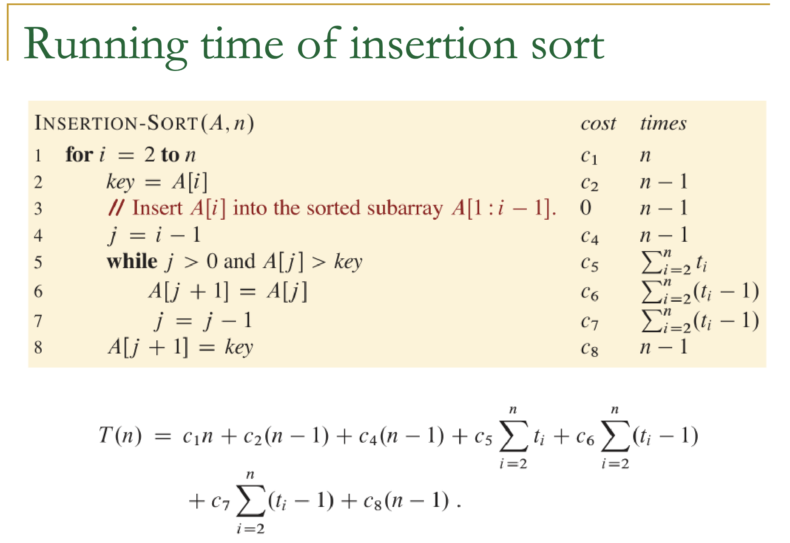

 *Notes*

--------------------------
# Wednesday January 17th
--------------------------

# What problems can algoriths solve?
* #### Managing big data on the internet
    * Search Enginge for findign data

# Why Study Algorithms ?
* #### Algorithm is a technology you should master
    * advacned computer artitecture
    * efficient algoirthms
    * machine learning
    * mobile devices
    * fast networking both wried and wireless
* ##### Consider sorting the list of n = 10^7 numbers as an example
    * #### **Insertion Sort** takes time C1N^2 where c1 is a constant
    * Suppose this is run on a fast computer that can do a numver of instructions
    * Suppose the code is optimized such taht c1 = 2
    (2* (10^7)^2 instructions) = 20000 instructions
* #### **Merge sort** takes time C1N logn where c1 is a constant
    * Considering this running on slow computer it would only take 1163 making it more optimized for the solution

# Friday January 19th

------------------------

# Sorting

* ### Problem of sorting
    * input: an array of numbers
    * Output: a permutation or reordering
        * Example:
            * Input: 8 2 4
            * output: 2 4 8
* ### Why is sorting important
    * sorting can be used to represent important problems and prprocess data for things like travel websites
* ### Sorting Algorithms
    * Insertion, Merge, Quicksort, Heapsort

* # Insertion Sort
*I believe that all of the content and pseudocode has the first index as 1 and not 0**
* https://www.youtube.com/watch?v=JU767SDMDvA&ab_channel=MichaelSambol
    * An efficient algo for sorting a small number of elements
    * **IDEA** similar to sorting a hand of playing cards
        * start with empty left hand and a pile of cards
        * grab from pile with right hand and insert into left hand in correct position with largest num to the right
    * 5 2 4 6 1 3
    * Look at the next position and swap
        * i.e. compare 5 with 2, 2 is less so swap
        * i.e. compare 5 with 4, 4 is less so swap
        * continue until sorted
 #### Psuedcode
    for i = 2n
        key = A[i]
        // insert A[i] int othe sorted subarray A[1:i-1]
        j = i - 1
        while
            J > 0 and A[j] > key
            A[j+i] = A[j]
            j = j - 1
        A[j+1] = key
* ### Why insertion sort works correctly?
    * **Loop invariant**
        * At the start of each iteration of the outer-for loop, the subarray A[1: i-1] consits of the elements orginially in A[1: i-1] but in the sorted order.
    * Need to show three things
        * **Intialization** : true prior to first interation
        * **Maintenance**: true before iteration and remains true before the next iteration
        * **Termination** : loop terminates and invariant shows it's true
* ### Running time analysis
    * denote input size n with T(n)
        * **size of the input n** : short easier to sort
        * **nature of the input** : an already sorted list is easier to sort no shit
    * Time analyzed on RAM model:
        * k-th line of code takes ck time to run where ck is a constant
    * 
    * **Best Case** : array is already sorted so ti = 1 for i = 2,3, ...... n
    * **Worst Case** :  array is in reverse sorted order so ti = i for i  = 2,3, .... n

* ### Worst-cast running time
    *we'll focus on worst*
    * It gives upper bound providing a runtime **gauruntee* certified by professor sun
    * Worst happens a lot i.e. searching for info on database that doesn't exist
    * The *average case* i.e. one that is half sorted half not is usually just as bad
* ###  Order of Growth
    * We simplify our runtime
    * we remove the leadin term i.e 3* O(n) we remove the 3 it's inconsequential in the long run
    * O(n) faster than O(n^2) regardless of numerical coefficient

--------------------------
# Wenesday January 24th
--------------------------
# More sorting algos (merge sort)
--------------------------

* ## Divide and Conquer
    * Recursion and three problem sets
        * *Divide*
            * The problem into further subproblems smaller than instances of the same problem
        * *Conquer*
            * subproblems are solved recursively
        * *Combine*
            * combine subsolutions to original problem
* ## Merge sort
    * uses divide and conquer
        * 
        * 
        * merge sort breaks up and array into two partitions, and then each two into two, etc. until there is only one left in each partition
        * next each element is compared against the first element of the other subarray and so on until it is reorganized in order.

* we ignore second term to get run time.
## SUMMARY
    Insertion Sort: O(n^2)
    Merge Sort: O(n log n)

    Insertion sort is **asymptotically** (ignoring constants) slower than merge sort, ti is faster for sorting small arrays in practice (due to its smaller constant factors)
    Insertion sort is used when there are sufficently small partitions from merge
