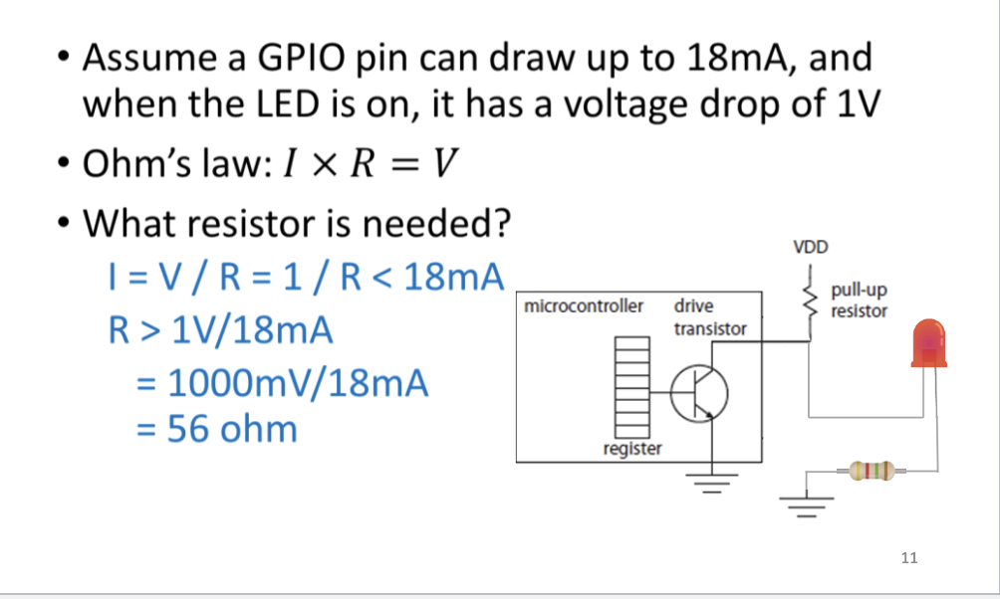
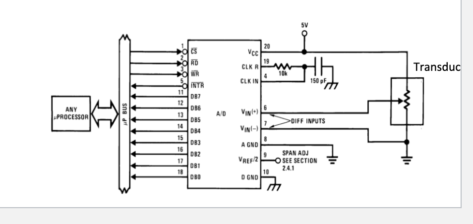
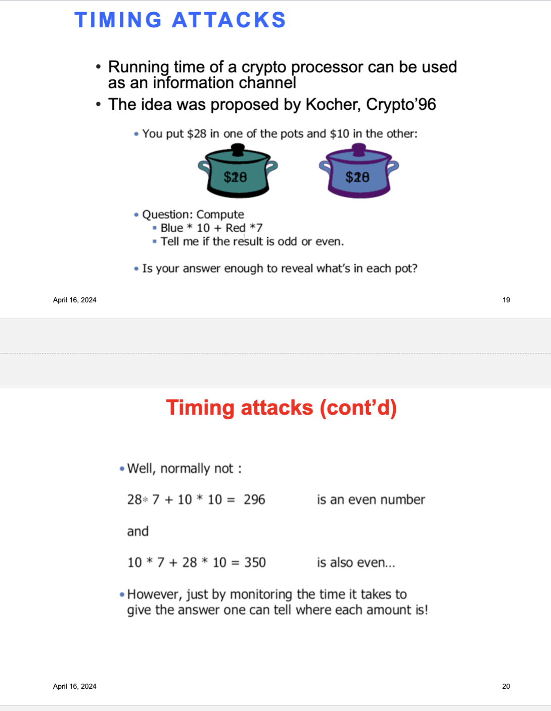

# 388 Notes After Midterm

----------
# Tuesday March 19th Lecture 12
--------
# I/O Interface
-------

## How does CPU talk to Devices?
* **Port Mapped I/O**
    * Use a seperate address space for I/O devices and use specia linstructions to access the I/O memory
* **Memory mapped I/O**
    * I/O memory is mapped into the CPU address space
    * Use load/stroe instruction to communicate with I/O devices
    *
## Memory Map of SiFive FE310

## General Purpose I/O (GPIO)
* Programmable digital I/O pins
*Use voltage levels to represent signals
    * 5V = logic 1
    * 0V = logic 0
* can be configured as input or output
* Useful to interact witih external devices

## Example; Turn on an LED

## Memory MAP of GPIO
    This is based on the c code for the blinking LED first lab. We are looking at lib.h file for GPIO names

## Lib.C example
    Again using C code here

## Volatile in C
* Using volatile compiler generates code to re-load variable each time it is reference in your program
* Wihout volatile the compiler may generate code that reuses value loaded in register

## I/O register paths

----------
# I/O Devices ADC/DAC
-------

## Voacb
* ADC (analog to digital converter)
* DAC (digital to analog converter)

## Examples
* microphone converts to 1010101
* 01010101 converts to sound from speakers

## DAC0808: 8-bit D/A Converter

## Using the DAC

## Inside DAC 0808

## DAC Resolution
* number of data inputs decides the resolution of DAC
* So if there are n digital inpit pin -> 2^n analog levels
* 8 input DAC -> 256 Discrete voltage levels

# QUESTION ON THE FINAL

## Example

## Step Size

## Example ADC Circuit

## Example: TI ADC080x 8-bit
* The ADC0801, ADC0802, ADC0803, ADC0804 etc. (all 8 bit input).
* Operates With Processors or as a Stand-Alone Device
* Interface to Temp Sensors, Voltage Sources, and Transducers

## Pin Functions
* *VREF*
* reference voltage for IC is either 1/2 of the voltage applied to VCC supply pin
or is euqal ot hte voltage that is externally forced at the VREF/2

## Timing

* 1.
    * When we decide we need to read from the ADC, we use the processor to assert CS (make CS =0)
    * CS: Chip select processor enables the ADC (active low)
    * At the same time WR (write) must be asserted (WR=0)
* 2.
    * After receiving the signal from the processor (CS and WR asserted), ADC starts conversions
    * Once conversion is done, ADC sends a signal via INTR pin
    * This means data can be read now from ADC
    * This is called a handshaking protocol
* 3.
    * Once INTR is asserted (INTR=0), the processor starts reading data from D0-D7
    * To do that, the processor asserts the read data signal (RD=0)
    * Keep asserted as long as data must be read

## Quiz on Canvas Quiz 6 I believe

1. Convert 0xF1 to binary
2. Map binary onto equation
3. Calculate the whole thing and multiply it by the 10V on the outside
* The answer is 9.4V

----------
# Interrupt
------------
# Thu Mar 21st
# Thu Mar 28st

------------

## Interrupt-Driven vs. Polling

## Polling Example with Keyboard
* Two I/O are needed to facilitaet pollign for device like keyboard
    * **Status register** : indicates a key struck
    * **Data register** : stroes the input date from keyboard
* CPU regulary checks status register
* If the specific bit of the status registe is set:
    * CPU reads from data regsiter

## Polling

* Problem
    *  CPU can't do nay useful things in the meantime
* Improvements
    * Check multiple I/O devices rather than one
    * Instead of keep checking the status (busy waiting), do some other useful work and then check again
    * Q. when to check again?
    * Q. what if the I/O is latency critical?
    * The CPU may miss the I/O when its ready and check when its not ready
* Can we do I/O immediately when tis is read ?
    * soluion: interrupt

## Interrupt
• What is an interrupt?
    • Notifications for the processor!
• Hardware interrupts
    • Devices (timer, disk, keyboard, ...) to CPU
• Software interrupts
    • Used for inter-process communication in a multi-core micro-controller
• Exceptions
    • Divide by zero, segmentation fault, ...
    • an unexpected event from within the process

## Interrupt Operation
* I/O device that may or may not have anything to do with the program that is running can
1. force the running program to stop,
2. have the processor execute a program that carries out the needs of the I/O device, and then
3. have the stopped program resume execution as if nothing had happened.

## Example
* Let us asume program A is running on teh CPU
* what happens when an interupt occur safter instruction n+2 occurs

## Two parts to Interrupt Driven I/O
1. Causign the interrupt to occur
2. Handlign the interrupt request

--------------------------------------------
# Part 1: Causing the Interrput to Occur
--------------------------------------------

## Conditions for Having an intterupt
* Several things must be true for an I/O device to actually interrupt the program that is running:
1. The I/O device must want service.
2. The device must have the right to request the service.
3. The device request must be more urgent than what the processor is currently doing.
* If all three elements are present, the processor stops executing the program that is running and takes care of the interrupt.

## I/O device must watn service

## I/O device has teh rigth to request the service

## Urgency of the Interrupt
* There may be many devices that want to interrupt the processor at a specific time.
* Each program runs at a specific priority level
* For an interrupt to go through, the interrupt should have a priority level higher that the program running on the processor
* We do not want a radio volume control to interrupt an image processing application in an autonomous vehicle! 17

## Generation of an INterrupt Signal

## I/O Device has teh right
* there is an interrupt enable bit in each I/O device
* Can be set/reset by the processor depending on whether or not the processor wants to give the I/O device the right to request service
* In most I/O devices, this interrupt enable (IE) bit is part of the device status register

## Urgency of the Interrupt
* Multiple devices may want to interrupt at a specific time. But the processor may not want to address all of them
* Hence, each rpogram runs at a specific priority level
* interrutp goes to higher priority process
    * We do not want a radio volume control to interrupt an image processing application in an autonomous vehicle!

## Interrupts can happen at anytime!

--------------------------------------------
# Part 1: Causing the Interrput to Occur
--------------------------------------------
Handing an interrupt goes through 3 stages:
1. Initiate the interrupt
2. Serve the interrupt
3. Return from the interrupt

1. **Initiate the interrupt**

* The processor does two things:
    * Save the state of the interrupted (current) program
        * So that we can restart the program once we handled the interrupt
        * Do we need to save the content of the register file?
    * Load the state of the interrupting program
* **Saving the state**
    * The state of a program is a snapshot fo the contents of all the programs resources
    * To save the state, we have two options: doing it thorugh hardware or software
* **Vectored Interrupts**
    * An **inerrupt vector** is provided to the provcessor by the interruption I/O device
    * The interrupt vector is used by the processor to reference an entry in the Interrupt Vector Table
    * Interrupt Vector Table consists of memory locations each containing the starting address of an Interrupt Service Routine
    * Interrupt Service Routines are program fragments stored in memory that service interrupt requests
* 

2. **Serve the interrupt**

3. **Return from the interrupt**

* Restorign the stage of the interrupted program and bring it back to execution

* **Local and Global Interrupts**
* The local interrupts are generated based on some activity internal to the processor.
    * They can be generated using software running in the processor or a timer that is counting towards a certain number.
    * Software interrupts are most useful for inter-processor communication
    * The global or external interrupts are interrupts from external devices such as GPIO, UART, I2C etc.
    * To handle the global interrupts the Si-Five processor has a module called PLIC or platform- level interrupt controller
        * PLIC is connected to GPIO, I2C, Etc.
        * PLIC supports 52 global interrupts with 7 priority level
        * We studied in last class that to combine the interrupt from multiple IO devices, we need priority encoding.
        * The PLIC module helps in this process.
    * When an interrupt arrives, corresponding interrupt pending bit is set
    * If interrupt is enabled for the device trap will occur
    * The trap process invokes a trap handler routine
    * The trap handler routine will CLAIM the interrupt
    * Read the memory mapped registers in the PLIC
        * returns ID of the interrupting device
        * After that it will clear the pending bit
        * To handle the local interrupts the Si-Five processor has a module called CLINT or Core Local INTerrupts

* 
* 

* **Control and Status REgisters (CSRs)
* Privilege registers for software/hardware communication
* Use special instructions to read/write

* **Interrupt related CSRs:**
    * mstatus: used to enable or disable global interrupt
        * 
    * mie: enable/disable individual interrupts
        * 
    * mip: which interrupts are currently pending
        * 
    * mtvec: base address of the interrupt vector
        * 
    * mepc: used for storing the PC before handling the interrupt
        <!-- *  -->
    * mcause: shows the cause of the interrupt
        * There many reasons a systme is interruption (local or global interr/exceptions)
        * mcause indicates teh even caused the trap
        * 

## Interrupt Priorities
* In Sifive there are there are the local and global interrupts have different priorities

* Sifive interrupts are prioritized as follows, in decreasing order of priority:
    * Machine external/global interrupts
    * Machine software interrupts
    * Machine timer interrupts
* Individual priorities of global interrupts are determined by the PLIC

## Setting external/global interrupts
* Each PLIC interrupt source can be assigned a priority by writing to its 32-bit memory-mapped priority register
* supports 7 levels of priority (0 being lowest)
    * 

## PLIC INterrupt Priority

----------
# Tuesday April 2nd Lecture 15
--------
# Reverse Engineering
-------

## Why are we learning security
* Security is ever in use and hardware needs to be secure

## Introduction
* 

## Bitstream / Binary / Software Rev. Eng
* UNdersand the properties of machien code
* Each arch has fixed set of opcode, operand, and register naming
* Cna be static or dynamic
* 

## Why rev. eng is helpful for embedded
* RE requires investigation of the ISA to understand the structure of the binary
* Requires analysis of the binary execution
* Hence, performing RE will improve our understanding of the ISA, code compilation process, and code simulation

## Reverse Engineering for Cybersecurity
* Legitamite purposes
    * understand the problem
    * identify vulnerbilities
    * analyze securit vulnerabilities
* Malicious pruposes
    * IP Piracy
    * Develop malware
    * trojan insertion

## Real world example
* Hackers manages to unlock tesla software-locekd features worth up to $15,000
    * attack involved reverse engineering binaries
    * understanding teh boot process of the software system

## White Hat reverse enginering for securit anlaysis
* “A white hat hacker reverse engineered 30 mobile financial applications and found sensitive data buried in the underlying code of nearly all apps examined.”
* “With this information a hacker could, for example, recover application programming interface (API) keys and use them to attack the vendor’s backend servers and compromise user data”

## Examples of deploying spyware and KEIL
    printing for exam looking good ahah

* 
* 
* 
* 
* 
* 
* 
* 
* 
* 
* 
* 
* 
* 
* 
* 
* 
* 
* 

----------
# Thursday April 4th
--------
# Binary Reverse Engineering
-------
## Reverse Engineering in Embedded Devices
* 
## Intro to 8051 MCU
* 
## 8051 Architecture
* 
* 
## Internal Memory
* 
* 
* 
* 
## Special Function Registers (SFR)
* 
## Intro to 8051 MCU ISA
* 
* 
* 
## Reverse Engineering Using Keil
* 
* 
* 
* 
## Example Homework Questions
* 

----------
# Tuesday April 9th
--------
# Buffer Overflow
-------

## Example Program Flow
* 
* 

## Registers Related to Stack
• EBP ( Extended Base pointer): points to the base of the stack
• ESP (Extended Stack Pointer): points to the top of the stack

• EIP: Extended Instruction pointer register, which points to the next instruction to be executed at any point of time
    • We have known it as the return address (RA) register
    • EIP is always the last thing to be saved on the stack frame of a given function

* 

## BSP ESP Takeaway
* Modifying the return address could alter the flow of code execution
* This could be done by overwriting on the EIP or EBP that is saved onto the stack
* What is the benefit of changing program flow execution?
* How an attacker can overwrite EBP/ESP

## Purpose of Buffer Overflow Attack
* Arbitray code execution
    * spawn a remote shlle or execute mailciious code
* Denial of service (DDOS)
    * Cause software to crash

## What can malicious code execution do?
* The Equifax Data Breach: In 2017, Equifax, one of the largest credit reporting agencies in the US, suffered a massive data breach.
* Hackers exploited a vulnerability in the Apache Struts web application framework using a combination of attakcs
* The specific vulnerability, identified as CVE-2017-5638, allowed attackers to execute arbitrary code on the server
* The breach resulted in the theft of sensitive information of over 143 million customers, including social security numbers, birth dates, and addresses.

## How can we execute maliciois code using overflow?
* The general idea is to overflow a buffer so that it overwrites the return address.
* When the function is done it will jump to whatever address is on the stack.
* We put some code in the buffer and set the return address to point to it!

## Example
* 
* 
* 
* 

## Steps of buffer overflow
* Inject attack code into buffer
* Overflow return address
* Redirect control flow to attack code
* Execute attack code

* 

## Summary
* Program fails to ensure that a write to a buffer is alwasy within its bound
* when a buffer ovflow happnes data structures in memory will be corrupted which can change program behaviors
* in many cases it can lead to the execution of arbitrary code by attacekrs

* 
* 
* 
* 

----------
# Tuesday April 16th
--------
# Side Channel Attacks
-------

## What is a side channel attack?
* Motivation:
    * Extract secret data being processed inside a hardware (e.g., cryptographic keys)
    * Extract information on the internal operation of the hardware (e.g., algorithmic steps)
    * Other forms of eavesdropping
* How?
    * Without directly looking at the internal bus or data in memory
    * Observe indirect data that is emitted during the execution of a computational process
* 5 commonly exploited side-channel emissions:
    * time consumtopn
    * timing and delay
    * electro-magnetic
    * optical
    * acoustic

## Side Channel in Embedded Systems
* Side channel is particularly more important for embedded systems
* Remote computing systems like servers are generally not accessible to end users -> makes SCA difficult
* Embedded devices are generally accessible to end users (smart watch, smart automotive)
* However, there are few remote SCA attacks!

## Power Side Channel
* 
* How to stop the read the waveforms put a transistor in between the oscillator arrows (the squiggly line)
* the oscilloscope reads the power

## Circuit Operation vs Power Signature
* Not average power over time, not peak power
    * Instantaneous power over time
        * Trace or curve, many samples
* Every operation within the device, such as fetching data from memory, processing, and storing data, has a unique power signature.
* Cryptographic operations, in particular, tend to cause noticeable fluctuations in power usage because they are computationally intensive.
* 

## Why Different Operation Consume Different Power
* **Logic** **Circuit** **Operation**:
    * constant supply voltage, supply current values
* Predominant Technology
    * **CMOS**
    * Lowe static power consumption
    * RElatively high dynamic power consumption
    * Power consumption depends on input
    * 
    * 

## Identifying Patterns
* **Identifying** **Patterns**:
    * Power consumption analysis reveals distinct patterns for cryptographic operations like modular exponentiation (RSA) or S-box lookups (AES).
* **Key** **Extraction** **from** **Patterns**:
    * Attackers use statistical methods to extract secret keys by correlating power spikes with specific operations or data processing.
    * Repeated analysis with different inputs allows for full or partial recovery of encryption keys.
* **Consequences** **of** **Key** **Extraction**:
    * With the extracted key, attackers can decrypt sensitive data, impersonate entities, or engage in other malicious activities.

## Simply Power Analysis (SPA)
* Monitor the device’s power consumption to deduce information about data and operation
* Example: SPA on Data encryption standard (DES) algorithm

## DES Basic Structure
* 

## Observing DES Rounds
* 
* round 1 is the first arrow
* round 2 is the second set of arrows

## More Operations
## jump vs no jump
* 
* you can firn k = 1 or u = 0 to revela part of a key

## Timing Attacks
* 

## Simple Example
* 

## Timing Attack on RSA Cryptosystem
* Modular exponentiation is a fundamental operation in many cryptographic algorithms, including RSA and Diffie- Hellman.
* The security of RSA relies on the difficulty of factoring the large modulus n, which is derived from two large prime numbers.
* Modular exponentiation is used because it allows for this one-way function—easy to compute in one direction (encryption) and hard to reverse (decryption) without the private key.

## Kocher's Obsevation
* 

## Outline of Kocher's Attack
* Idea: guess some bits of the exponent and predict how long decryption will take
* If guess is correct, we will observe correlation; if incorrect, then prediction will look random
    * This is a signal detection problem, where signal is timing variation due to guessed exponent bits
    * The more bits you already know, the stronger the signal, thus easier to detect (error-correction property)
* Start by guessing a few top bits, look at correlations for each guess, pick the most promising candidate and continue

----------
# Thursday April 18th
--------
# Operating System and Processes
-------

## Systems
* 

## Bare-metal vs OS-Assisted

* **Bare**-**Metal**
    * Pro:
        * Requires less hardware resources
        * fast for small and simple applicaitons
    * Con:
        * not scalable/suitable for comples and real time applications
        * require low level knowledge of io device
        * no mutli-threading
* **OS**-**Assisted**
    * Pro:
        * Scalabel for large and complex application
        * requries less konwledge of io (uses device drivers)
        * multi-threading available
    * Con:
        * not suitable for small applicaiton
        * requries significant hardware resources

## Different Types of OS
* **Personal** **computer** **OS**
    * Provides an easy-to-use environment to a single user
    * User interface elements (desktops, GUIs etc.) are important here.
    * Windows 7 and Mac OS X are examples.
* **Real**-**time** **OS**
    * Designed to react to input within certain time constraints.
    * Input data typically comes from external sensors (not from human)
    * Many embedded systems are also real-time systems.
    * Example: Keil RTX is Real-Time Operating System designed for ARM and Cortex-M devices
* **Embedded** **OS**
    * Designed to be compact, efficient at resource usage, and reliable
    * Limited application software
    * Ex: Embedded Linux for mobile devices

## Benefits of OS
* Advantage 1: Software Abstraction:
    * Software side of a computer with OS can be divided into programs, libraries and the operating system.
    * Each layer hides the complexity of the layer below, and provides a set of abstract services and concepts to the layer above.
* Example of Abstraction: the computer's hard disk or SSD allows data to be stored on it in a set of fixed-sized blocks or pages.
    * The OS hides this complexity, and provides the concept of files to the application software.
    * In turn, an application program such as a word processor hides the idea of a file, and allows the user to work with documents instead.
* Advantage 2: Resource allocation and management:
    * The resources in a computer (CPU, memory, disk space) are limited.
    * The operating system must act as a resource manager, optimizing
    * the use of the resources
    * It performs various resource sharing and optimization tasks, discussed in next slide
## Operating System Tasks

* **Process** **Management**
    * Allocating/ de-allocating processor to a process and time-sharing the processor across multiple CPU
    * Keeping track of process status
    * Assigning priority of process, etc.
* **Memory** **Management**
    * Allocating/De-allocating memory efficiently across processes
    * Keeping track of memory usage
* **Storage**/**File** **Management**
    * Tracking where files and programs are stored
    * Which parts are available for storage etc.
* **Device** **Management**
    * Controlling the device communication
    * Allocating/de-allocating/time-sharing device with processes
* **Protection** **and** **Security**

## Privilege Mode
* For operating system to hide the computer's hardware, and manage the hardware resources, it **needs** **to** **prevent** **the** **application** **software** **from** **accessing** **the** **hardware** directly.
* In a processor there are many privilege modes. Basically certain functions have less restrictions then other when running based on their privilege levels.
* Example:
    * certain instructions/actions are not permitted
    * some memory areas cannot be accessed, etc.
    * 

## System Calls
* 

## System Call Example
* 

## Modern OS are Interrupt Driven
* 

## The Process
* 

## Process States
* 
