# Notes

---------------
# **Thursday January 18th**
---------------
### Overview of the topics

### Embedded Systems
* Computers are desigend for a specific purpose
* *Modern embedded systems contain a large number chips or integrated circuits (ICs)*

##### Types Digital, Analog, and Mixed Signals
* **Digital IC**
    * Microprocessor
* **Analog Ic**
    * Sensors
* **Analog-mixed -signal**
* Contains both digital and analog in a single chip/IC

##### Embedded vs. general computing systems: Number of Applications
* Embedded:
    * Not end-user programmable, On-time
    * Power, memory & compute limited: i.e. smartwathch, implantable device
* General computing:
    * End-user programmable, Faster is awlays better!
    * Greater resouce! i.e. servers

### Internet of Things (IoT)
* **Internet** connected embedded systems
* Interconnection to the internet of devices is important

### Cyber-Physical Systes (CPS)
* Cyber system (computer) + physical system (Plant)
* Embedded systems but integration emphasied

### Real-Time Systems
* The correctness not only logical and computation but produced at the correct time
* A CORRECT VALUE AT THE WRONG TIME IS A FAULT

### Trends in modern embeded systems
* Trending towards: cheaper, powerful, and more connected
* The ECU computing capactiy in BMW i8 is greater than the i3 ( developed in 2014 or earlier )
* Rasberry pi 2 had even greater speeds
    * @ 4,744 MIPS (Millions of instructions per second) 1.0 GHz
* Human like intelligence in modern vehicles
* **Super computer introduced on a car in tesla 2019**
    * Full Self Driving Chip
    * Whats inside
        * CPU
        * GPU (1Ghz, 600 GLOPS) ( GIGA FLOPS ) GIGA FLOPS that is some cool shit man!!!!!!
        * Neural processing units to handle floating points

### Performance
* Processing real time from sensors in cars has increased a lot
* Autombile changes described in three step process]
    * **Inform**
        * Drivers wanted a way to meld lifestyle and car
    * **Assist**
        * Assisting drivers
    * **Assume**
        * communicate collaborate and fufill all functions

### Efficiency
* Size weight, power, and cost constraints are all decreasing as time progresses

### Safety
    Examples below are examples of things that have outside influences and can have failure
* *Examples
    * Therac 25
        * Computer controlled radiation therapy
    * Arian 5
        * Rocket destroyed in 40 seconds

### Security and Privacy
    Confidentiality issues: Infromation could be stolen

* Attack can be done in many ways
    * **Side channel leakage** : Observing the power consumption of the chip to guess the passwords
    * **Hardware or software trojan** : hidden functionality in software or hardware that leaks information to outsider
    * **Physical Attack** : Some dude touches your stuff and does some nasty stuff to it
###### .
    Integrity issues: An attacmed can start a failure inside a system

* Attack can be done in many ways
    * **Fault Inejection** : Change voltage to corrupt output
    * **Hardware or software trojan** : hidden functionality in software or hardware that leaks information to outsider
    * **Physical Attack** : Tampering mode or chip on your own hardware (i.e. your xbox series x version x installing xtynine)

### My Garbage Summary
* Limited Function computers in real world
* Requirements: perfromance, efficiency, safety, secrutiy, and privacy

---------------
# **TUESDAY JANUARY 23RD 2023**
---------------

---------------
# **EMBEDDED SOFTWARE DEVELOPMENT**
---------------

* **Software Abstraction**
    * Application programs, os, compiler

* **Hardware**
    * Primary Component: microprocessor or microcontroller
    * Abstractions: microacrchitecture and instruction set architecture
    * 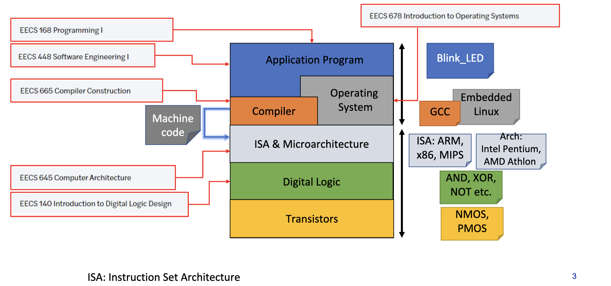

* **Example Abstraction**
    * *Application Software*
        * Word processor, internet, browser, games
    * *System software*
        * *OS* : manages resources to run applications
        * *Compiler* : translates programs to machine readable binary
    * *Hardware*
        * Processor, memory, IO
### Instructure Set Architecture
* (ISA)
* Acts as interface between hardware and software
* abstraction of hardware that can be controlled by assemby
* considred a manual for assembly
* specifis;
    * memory org
    * register set
    * instruction set (multiply, add, etc.)
* ARM, x86, MIPS, SPARC, and PowerPC

* *Analogy*
    * ISA of a car describes what the driver needs to do to get the carry out the drivers wishes

### Microarchitecture
* Design describes interconnections of microarch elelments
* Implementation of the ISA
* x86-64 : AMD, Intel

### Embed Sys Dev Platform
* exe runs on devices with the same arch

### Compiler tool chain
* .c/.h -> .i -> .s -> .o -> .exe
* prprocessor :
    * compiler : gcc
        * assembler  : as
            * linker : ld, turns machine code into executable code

### Cross Compilation
* compile on one system run on another
* hex holds 4x binary

### Problems
* Building can be complex
* building manually takes time and effot
* *SO WE USE MAKEFILESSS*

### Makefiles
* Make is a tool which controls the generation of executables and other non-source files of a program
* make file automates commands

---------------
# **Thursday January 25th**
---------------
# **Programming Languages**
---------------
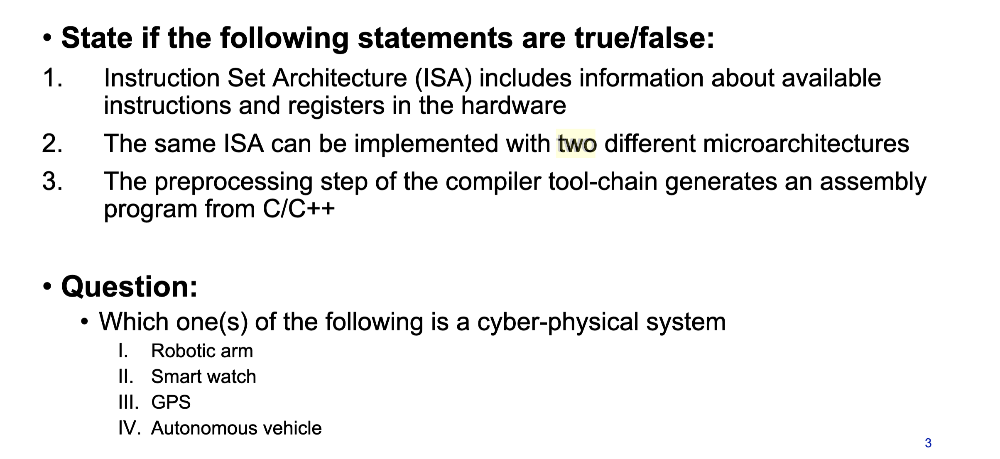
**Answers**
1. True
2. True
3. True
* Cyber-physical examples: (i. robotic arm) and (iv. Autonomous vehicle)

### **High Level**
* Feasbility of learning, porting across OS

### **Low Level**
* Lower code overhead for execution
* Bitwise operatoin
* memory management
    * Pointers, dynamic memory allocation
* I/O Operation

### **Bits vs bites**
* b7b6b5b4b43b2b1b0
* b7 Most significant bit (msb)
* b0 Least significant bit (LSB)
* **MSB** **LSB**
    * 1000 > than 0001

### **Declaring variables**
* must have data type and possible declaration of variable
* python is dynamically types while thigns like c/c++ are statically typed

### **Benefits of static vs dynamically typed**
* **Dynamically Typed**
    * flexible and faster to produce
* **Statically Typed**
    * *efficient machine code generation*
    * *low-level control*
    * *generates optimized machine code*
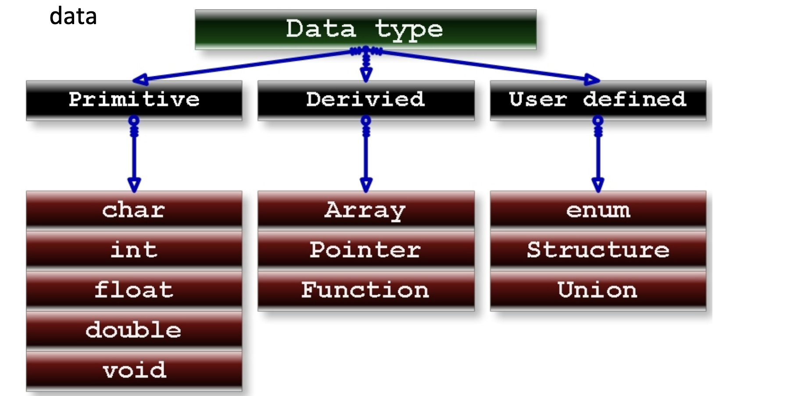
### **Differnet variables in computer memory**
* Each address location typically hold 8-bit (i.e., 1-byte) of data.
* A 4-byte int value occupies 4 memory locations. A 32-bit system typically uses 32-bit addresses.

### **Type Modifiers**
* 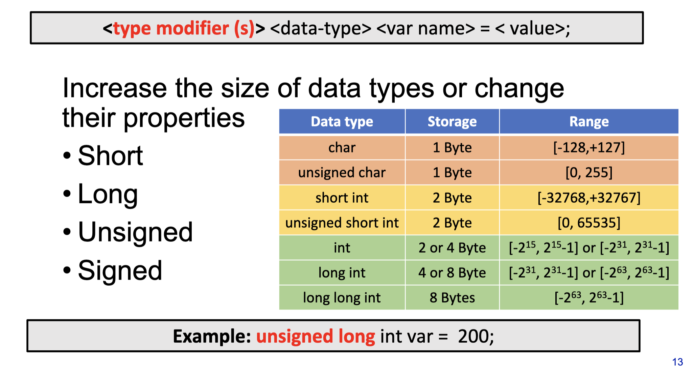

### **Type Qualifier**
*  **const** : variable can't be changed
*  **volatile** : tells the compiler that the value of the variable may change at any time--without any action being taken by the nearby code (could change by the hardware instead)

### **Number Systems**
* Modern number system : **POSITIONAL SYSTEM**
* hex base 16
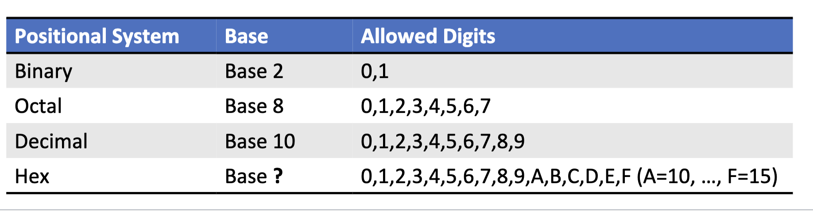
* How to convert those pesky numbers in case you ever *"find yourself debugging your assembly programs" - Dr. Hoque*
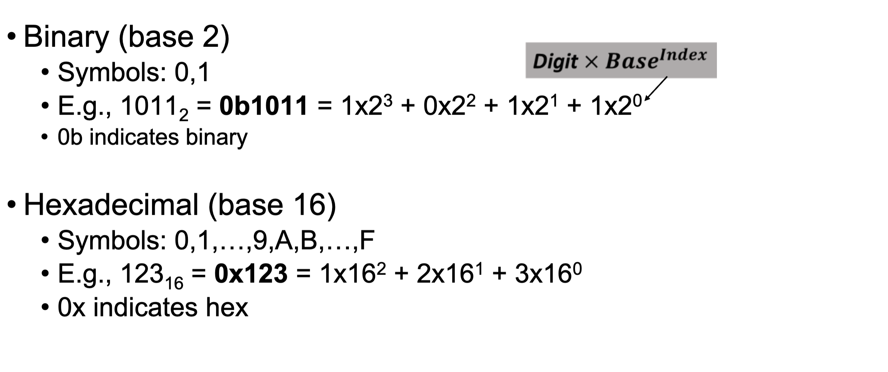
### **Representing Signed numbers**
* sign magnitude method
    * reserve a bit to represnet the sign (i.e 001 = +1 and 101 = -1)
* twos compliment
    * invert digits and add one
    * eliminate negative zero and make arithmetic in hardware easier
    * 0b means binary and 0x means hex
---------------
# **Tuesday January 30th**
---------------
# **Computer Language**
---------------
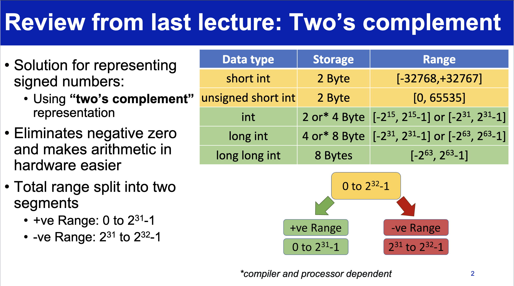

### **Fractional Numbers: Float and Double**
* **Float**
   ( *IEEE 754 single precision floating point numbers*)
    * 1-bit sign, 8-bits exponent, 23-bits fraction
    * 6 significant decimal digits of precision
* **Double**
    * 1-bit sign, 11-bits exponent, 52-bits fraction
    * 15-17 significant decimal digits of precision
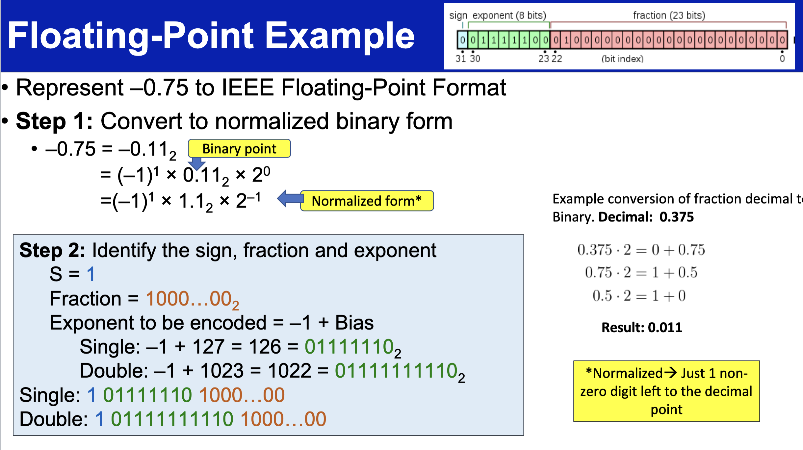

## The Language of the Computer
---------------------------------

### **The Software stack**
* Application Software
    * word processro, internet browser
* System software
    * OS, compilterç
* Hardware
    * Processor, memory, IO

### **The Software stack**
* MIPS (Microprocessor without Interlocked Pipelined Stages
* widely used by the embedded market (hardware dudes)
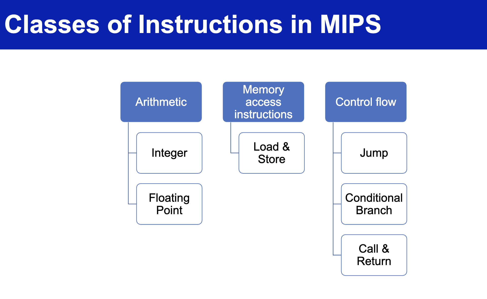

### **Opcode nad Operand**
* **Opcode** : operation that is executed by the CPU (ex: add, sub)
* **Operand** : data or memory location used to execute that operation
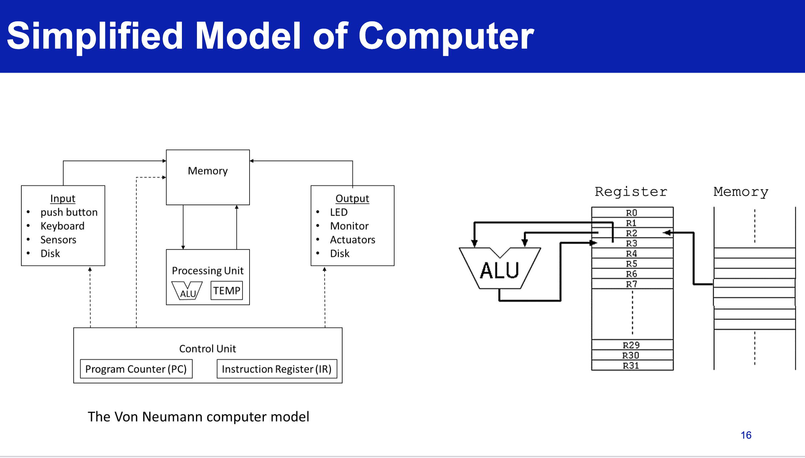
* Register is the TEMP
### **Registers**
* **Registers**
* limited numver of memory location connected to ALU
* MIPS32 (MIPS) has 32 registers (there is also MIPS64)
    * Each of the 32 registers hold 32 bits
    * **C Code**
        * A = B + C;
        * A = B - C;
    * **MIPS Code**
        * add $r1, $r2, $r3
        * sub $r1, $r2, $r3
* different register values hold different usages
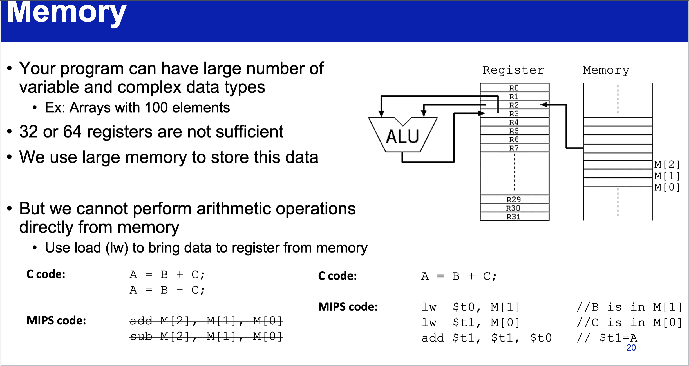
* C code: g= h + A[7]; //first element is A[0]
* MIPS code:
    * lw $t0, 32($s1) //32 because 8 elements
    * add $t0, $s2, $t0
        * 32 because you have to move 32 because each address has 4 bytes
        * this is saying that you are loading the value of the eight element of a to register t0
        * you are adding the two elements to t0
    * sw $t0, 48($s1)
        * This part of code sends/stores the value at A[12]
---------------
# **Thursday Feburary 1st**
---------------
# **Language of the Computer**
---------------

### How bytes of a word are organized in memory?
* **Big Endian** : most significant bit is stored at the lowest memory address. Ex: PowerPC
* **Little Endian** : Just reverse of big Endian Ex: Intel , x86 processors, ARM
* 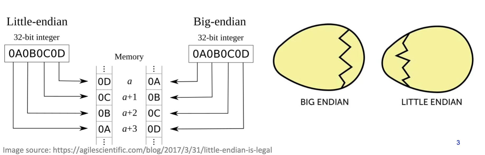
* 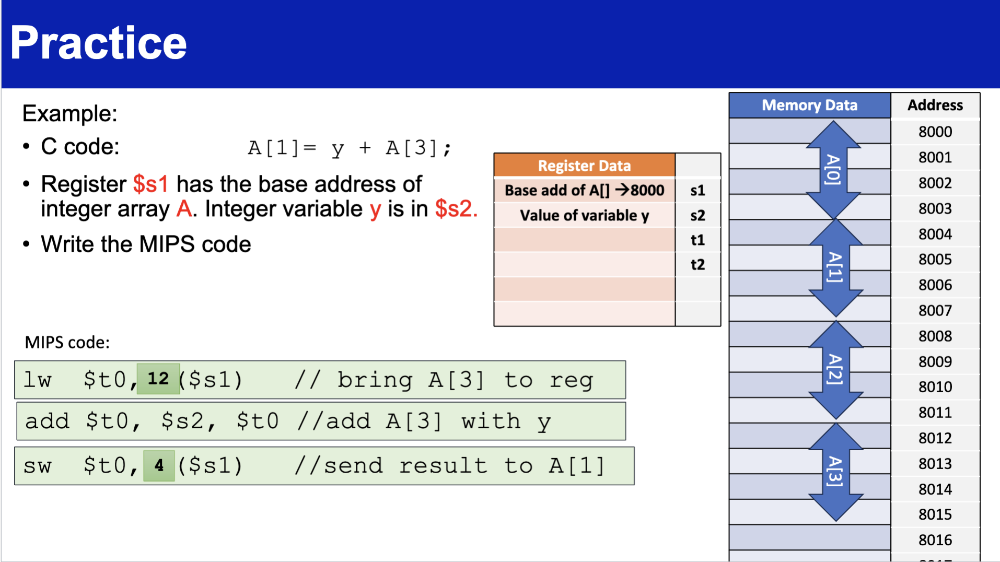
### Assembly to binary translation
* **Basic Instruction formats**
    * R (r type) -> opcode rs rt rd shamt funct
    * I (i type) -> opcode rs rt immediate
    * J (j type) -> opcode address
* 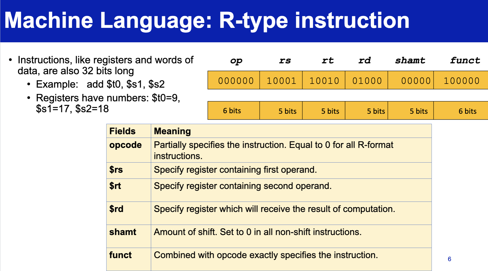
* 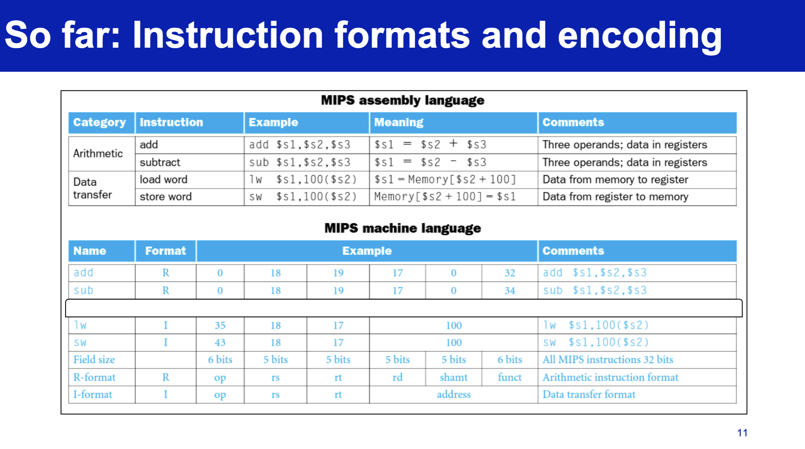
* MIPS Instruction: addi $s3, $s3, 22 -> (adds 22 to s3)
* 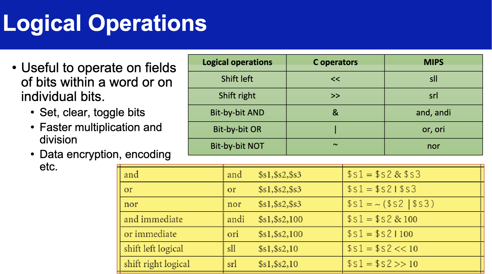
* **Bitwise AND/OR**
    * and $t0,$t1,$t2    #reg t0 = reg t1 & reg t2
    * 1000 and 0111 = 0000
    * 1 and 0 = 0 or 0 and 0 = 0
    * 1 and 1 = 1
* **Bitwise Shfits**
    * sll = left shift (<<)
    * srl = right shift (>>)
    * sll $t2,$s0,4 -> reg t2 = reg s0 shifted 4 bits
    * 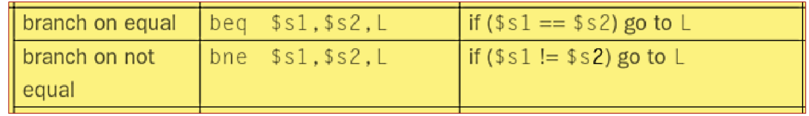
    jumping to L
### Multiplication is with a right shift
    this only works with unsigned numbers because the sign will be lost
* 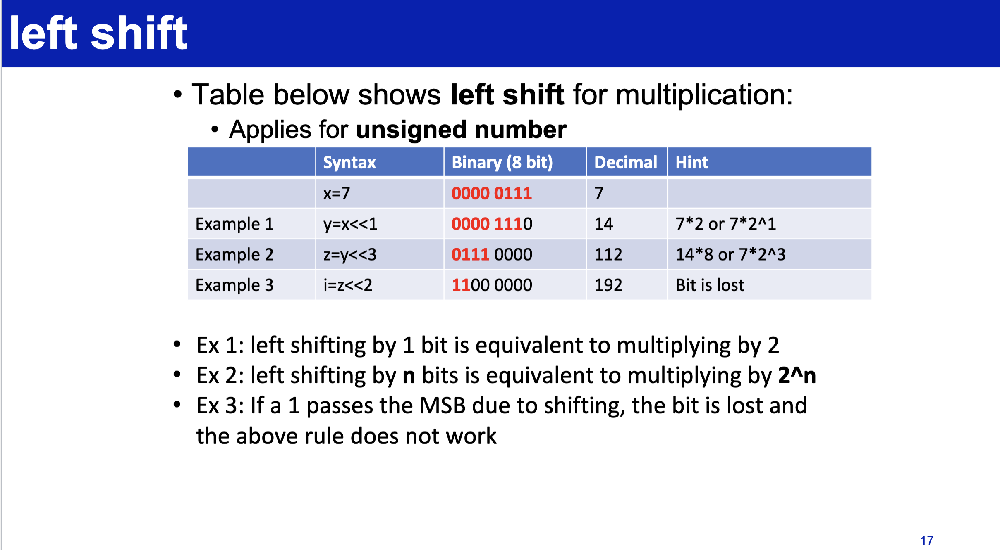
### Division is a right shift
    this only works with unsigned numbers again
* 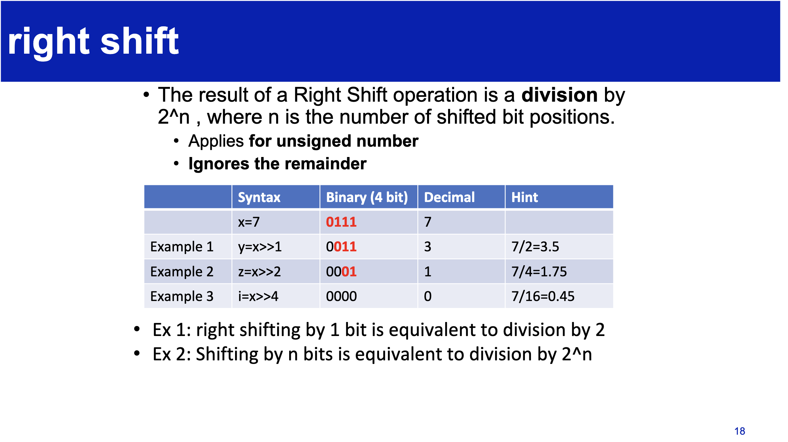
* 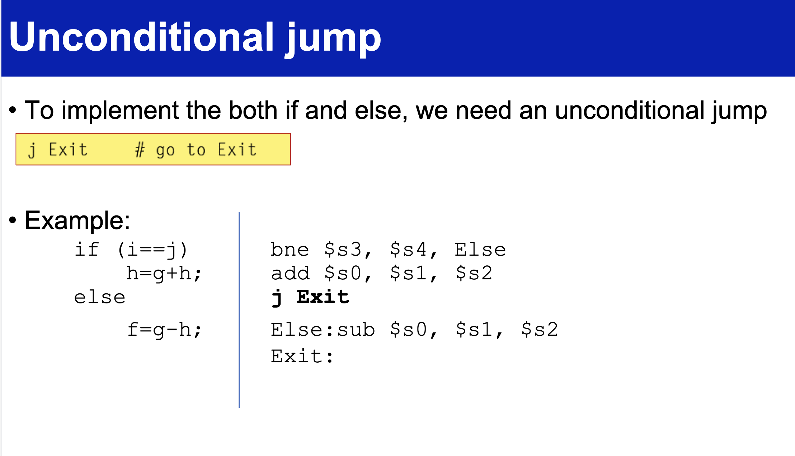
### Loops
* 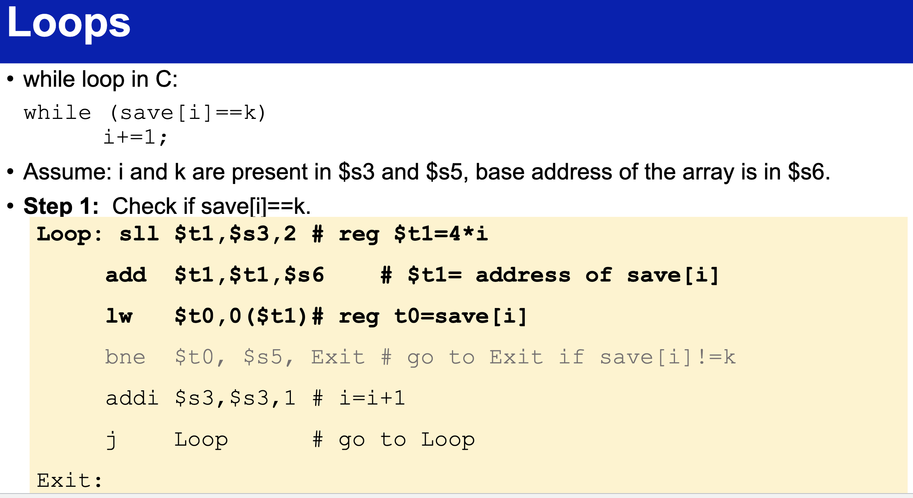
* 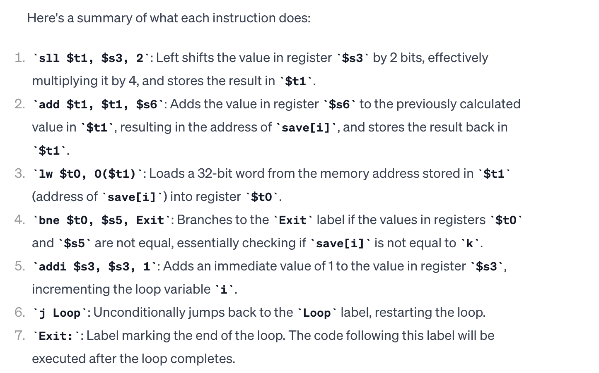

### Control Flow
* Set on less than (slt)
* this can be used to compare two registers for greater or less than
* no set greater than because the simpler the hardware the better the clock speed (**lightning fast**)
    * 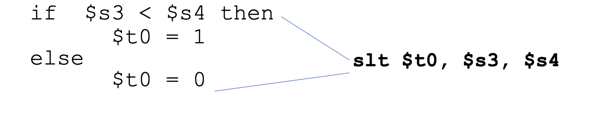
* comparing constants with variables we use slti
*       slti $t0,$s2,10
   this is the same as saying
*       t0 = 1 if s2 < 10

---------------
# **Tuesday Feburary 16th**
---------------
# ****
---------------
**Most of the content was from lecture slides 5 so I includd it in the previoous day! Happy assembly!**
