# Notes

---------------
# **Thursday January 18th**
---------------
### Overview of the topics

### Embedded Systems
* Computers are desigend for a specific purpose
* *Modern embedded systems contain a large number chips or integrated circuits (ICs)*

##### Types Digital, Analog, and Mixed Signals
* **Digital IC**
    * Microprocessor
* **Analog Ic**
    * Sensors
* **Analog-mixed -signal**
* Contains both digital and analog in a single chip/IC

##### Embedded vs. general computing systems: Number of Applications
* Embedded:
    * Not end-user programmable, On-time
    * Power, memory & compute limited: i.e. smartwathch, implantable device
* General computing:
    * End-user programmable, Faster is awlays better!
    * Greater resouce! i.e. servers

### Internet of Things (IoT)
* **Internet** connected embedded systems
* Interconnection to the internet of devices is important

### Cyber-Physical Systes (CPS)
* Cyber system (computer) + physical system (Plant)
* Embedded systems but integration emphasied

### Real-Time Systems
* The correctness not only logical and computation but produced at the correct time
* A CORRECT VALUE AT THE WRONG TIME IS A FAULT

### Trends in modern embeded systems
* Trending towards: cheaper, powerful, and more connected
* The ECU computing capactiy in BMW i8 is greater than the i3 ( developed in 2014 or earlier )
* Rasberry pi 2 had even greater speeds
    * @ 4,744 MIPS (Millions of instructions per second) 1.0 GHz
* Human like intelligence in modern vehicles
* **Super computer introduced on a car in tesla 2019**
    * Full Self Driving Chip
    * Whats inside
        * CPU
        * GPU (1Ghz, 600 GLOPS) ( GIGA FLOPS ) GIGA FLOPS that is some cool shit man!!!!!!
        * Neural processing units to handle floating points

### Performance
* Processing real time from sensors in cars has increased a lot
* Autombile changes described in three step process]
    * **Inform**
        * Drivers wanted a way to meld lifestyle and car
    * **Assist**
        * Assisting drivers
    * **Assume**
        * communicate collaborate and fufill all functions

### Efficiency
* Size weight, power, and cost constraints are all decreasing as time progresses

### Safety
    Examples below are examples of things that have outside influences and can have failure
* *Examples
    * Therac 25
        * Computer controlled radiation therapy
    * Arian 5
        * Rocket destroyed in 40 seconds

### Security and Privacy
    Confidentiality issues: Infromation could be stolen

* Attack can be done in many ways
    * **Side channel leakage** : Observing the power consumption of the chip to guess the passwords
    * **Hardware or software trojan** : hidden functionality in software or hardware that leaks information to outsider
    * **Physical Attack** : Some dude touches your stuff and does some nasty stuff to it
###### .
    Integrity issues: An attacmed can start a failure inside a system

* Attack can be done in many ways
    * **Fault Inejection** : Change voltage to corrupt output
    * **Hardware or software trojan** : hidden functionality in software or hardware that leaks information to outsider
    * **Physical Attack** : Tampering mode or chip on your own hardware (i.e. your xbox series x version x installing xtynine)

### My Garbage Summary
* Limited Function computers in real world
* Requirements: perfromance, efficiency, safety, secrutiy, and privacy

---------------
# **TUESDAY JANUARY 23RD 2023**
---------------

---------------
# **EMBEDDED SOFTWARE DEVELOPMENT**
---------------

* **Software Abstraction**
    * Application programs, os, compiler

* **Hardware**
    * Primary Component: microprocessor or microcontroller
    * Abstractions: microacrchitecture and instruction set architecture
    * 

* **Example Abstraction**
    * *Application Software*
        * Word processor, internet, browser, games
    * *System software*
        * *OS* : manages resources to run applications
        * *Compiler* : translates programs to machine readable binary
    * *Hardware*
        * Processor, memory, IO
### Instructure Set Architecture
* (ISA)
* Acts as interface between hardware and software
* abstraction of hardware that can be controlled by assemby
* considred a manual for assembly
* specifis;
    * memory org
    * register set
    * instruction set (multiply, add, etc.)
* ARM, x86, MIPS, SPARC, and PowerPC

* *Analogy*
    * ISA of a car describes what the driver needs to do to get the carry out the drivers wishes

### Microarchitecture
* Design describes interconnections of microarch elelments
* Implementation of the ISA
* x86-64 : AMD, Intel

### Embed Sys Dev Platform
* exe runs on devices with the same arch

### Compiler tool chain
* .c/.h -> .i -> .s -> .o -> .exe
* prprocessor :
    * compiler : gcc
        * assembler  : as
            * linker : ld, turns machine code into executable code

### Cross Compilation
* compile on one system run on another
* hex holds 4x binary

### Problems
* Building can be complex
* building manually takes time and effot
* *SO WE USE MAKEFILESSS*

### Makefiles
* Make is a tool which controls the generation of executables and other non-source files of a program
* make file automates commands

---------------
# **Thursday January 25th**
---------------
# **Programming Languages**
---------------

**Answers**
1. True
2. True
3. True
* Cyber-physical examples: (i. robotic arm) and (iv. Autonomous vehicle)

### **High Level**
* Feasbility of learning, porting across OS

### **Low Level**
* Lower code overhead for execution
* Bitwise operatoin
* memory management
    * Pointers, dynamic memory allocation
* I/O Operation

### **Bits vs bites**
* b7b6b5b4b43b2b1b0
* b7 Most significant bit (msb)
* b0 Least significant bit (LSB)
* **MSB** **LSB**
    * 1000 > than 0001

### **Declaring variables**
* must have data type and possible declaration of variable
* python is dynamically types while thigns like c/c++ are statically typed

### **Benefits of static vs dynamically typed**
* **Dynamically Typed**
    * flexible and faster to produce
* **Statically Typed**
    * *efficient machine code generation*
    * *low-level control*
    * *generates optimized machine code*

### **Differnet variables in computer memory**
* Each address location typically hold 8-bit (i.e., 1-byte) of data.
* A 4-byte int value occupies 4 memory locations. A 32-bit system typically uses 32-bit addresses.

### **Type Modifiers**
* 

### **Type Qualifier**
*  **const** : variable can't be changed
*  **volatile** : tells the compiler that the value of the variable may change at any time--without any action being taken by the nearby code (could change by the hardware instead)

### **Number Systems**
* Modern number system : **POSITIONAL SYSTEM**
* hex base 16

* How to convert those pesky numbers in case you ever *"find yourself debugging your assembly programs" - Dr. Hoque*

### **Representing Signed numbers**
* sign magnitude method
    * reserve a bit to represnet the sign (i.e 001 = +1 and 101 = -1)
* twos compliment
    * invert digits and add one
    * eliminate negative zero and make arithmetic in hardware easier
    * 0b means binary and 0x means hex
---------------
# **Tuesday January 30th**
---------------
# **Computer Language**
---------------

### **Fractional Numbers: Float and Double**
* **Float**
   ( *IEEE 754 single precision floating point numbers*)
    * 1-bit sign, 8-bits exponent, 23-bits fraction
    * 6 significant decimal digits of precision
* **Double**
    * 1-bit sign, 11-bits exponent, 52-bits fraction
    * 15-17 significant decimal digits of precision

## The Language of the Computer
---------------------------------

### **The Software stack**
* Application Software
    * word processro, internet browser
* System software
    * OS, compilterç
* Hardware
    * Processor, memory, IO

### **The Software stack**
* MIPS (Microprocessor without Interlocked Pipelined Stages
* widely used by the embedded market (hardware dudes)

### **Opcode nad Operand**
* **Opcode** : operation that is executed by the CPU (ex: add, sub)
* **Operand** : data or memory location used to execute that operation

* Register is the TEMP
### **Registers**
* **Registers**
* limited numver of memory location connected to ALU
* MIPS32 (MIPS) has 32 registers (there is also MIPS64)
    * Each of the 32 registers hold 32 bits
    * **C Code**
        * A = B + C;
        * A = B - C;
    * **MIPS Code**
        * add $r1, $r2, $r3
        * sub $r1, $r2, $r3
* different register values hold different usages

* C code: g= h + A[7]; //first element is A[0]
* MIPS code:
    * lw $t0, 32($s1) //32 because 8 elements
    * add $t0, $s2, $t0
        * 32 because you have to move 32 because each address has 4 bytes
        * this is saying that you are loading the value of the eight element of a to register t0
        * you are adding the two elements to t0
    * sw $t0, 48($s1)
        * This part of code sends/stores the value at A[12]
---------------
# **Thursday Feburary 1st**
---------------
# **Language of the Computer**
---------------

### How bytes of a word are organized in memory?
* **Big Endian** : most significant bit is stored at the lowest memory address. Ex: PowerPC
* **Little Endian** : Just reverse of big Endian Ex: Intel , x86 processors, ARM
* 
* 
### Assembly to binary translation
* **Basic Instruction formats**
    * R (r type) -> opcode rs rt rd shamt funct
    * I (i type) -> opcode rs rt immediate
    * J (j type) -> opcode address
* 
* 
* MIPS Instruction: addi $s3, $s3, 22 -> (adds 22 to s3)
* 
* **Bitwise AND/OR**
    * and $t0,$t1,$t2    #reg t0 = reg t1 & reg t2
    * 1000 and 0111 = 0000
    * 1 and 0 = 0 or 0 and 0 = 0
    * 1 and 1 = 1
* **Bitwise Shfits**
    * sll = left shift (<<)
    * srl = right shift (>>)
    * sll $t2,$s0,4 -> reg t2 = reg s0 shifted 4 bits
    * 
    jumping to L
### Multiplication is with a right shift
    this only works with unsigned numbers because the sign will be lost
* 
### Division is a right shift
    this only works with unsigned numbers again
* 
* 
### Loops
* 
* 

### Control Flow
* Set on less than (slt)
* this can be used to compare two registers for greater or less than
* no set greater than because the simpler the hardware the better the clock speed (**lightning fast**)
    * 
* comparing constants with variables we use slti
*       slti $t0,$s2,10
   this is the same as saying
*       t0 = 1 if s2 < 10

---------------
# **Tuesday Feburary 16th Lecture 6**
---------------
# ****
---------------
**Most of the content was from lecture slides 5 so I includd it in the previoous day! Happy assembly!**
* check the MIPS cheat sheet and add it here and add the table from the last slide in lecture 5

---------------
# **Tuesday Feburary 16th Lecture 6**
---------------
# **Functions**
---------------

### Function call or Procedures
* A function makes code reusable

### Memory Map of Running a Program

1. Static
    * Text/Code segment
    * Intialized data segment
    * Unintialized data segment
2. Stack
3. Heap
* 
**Program Counter (PC)**
    * Register that holds addresses of instructions and incremented after fetching instruction

### Caller and Callee
* if main() calls sum()
    * main is caller and sum is callee
    * Caller use the same register set as teh callee

### Callign a Fucntion

### Instructions to use to execute a jump

### Register Management

### Answerin Questions on the previous slide
* Who is responsible for saving important registers across function calls
    * The **caller** knows which registers are important sand should be saved
    * The **callee** knows what registers it will use and overwrite
* However, inthe rtpical "black box" proramming approach teh caller adn teh callee do not know anything about each others' implementation
    * Difference functions can be written by different people but should stil run regardless when compiled

### So how do functins cooperate and share registers when they don't know anything about each other?
* **Approach 1:**
    * The caller saves registes to ensure they are not written
    * 
    * main is trying to preserve a0 a1 s0 s1 by giving it arbitrary values
* **Approach 2:**
    * Callee save all registers
    * 
* **Best Approach**
    * 

### Accessing and Popping Elements
* 
* 

---------------
# **Tuesday Feburary 13th**
---------------
# **Introduction to computing systems**
---------------
*I got super lazy here are all the slides LOL this should print nicely for exam*

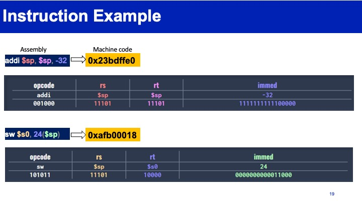
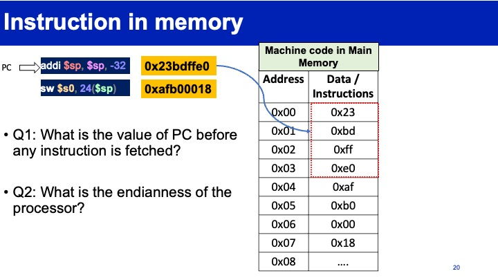

---------------
# **Thursday Feburary 15th**
---------------
# **Lecture 8 Digital Logic and Design**
---------------

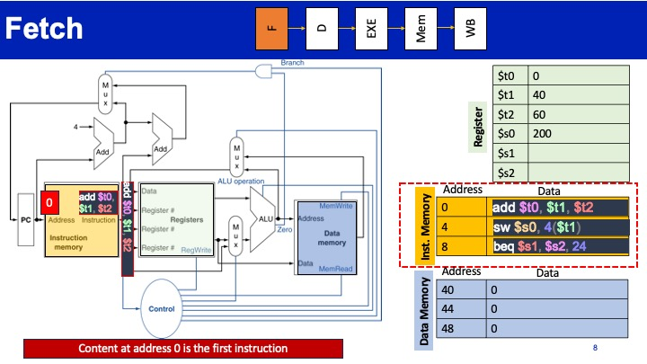

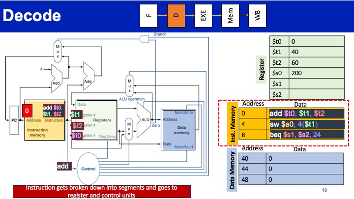
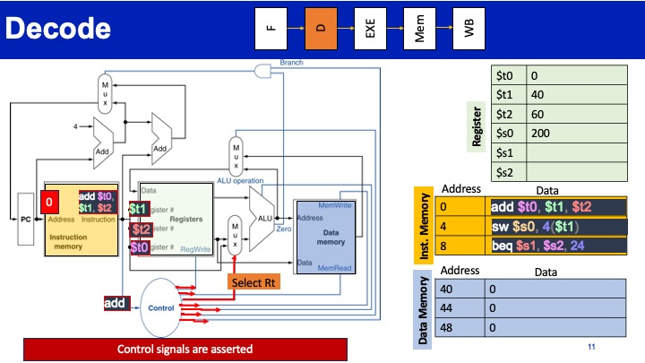

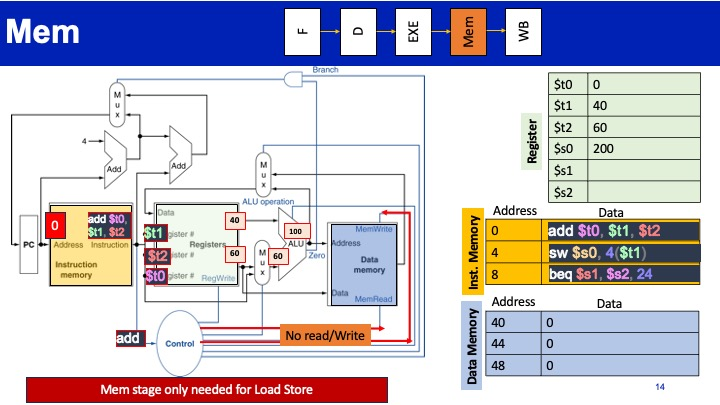
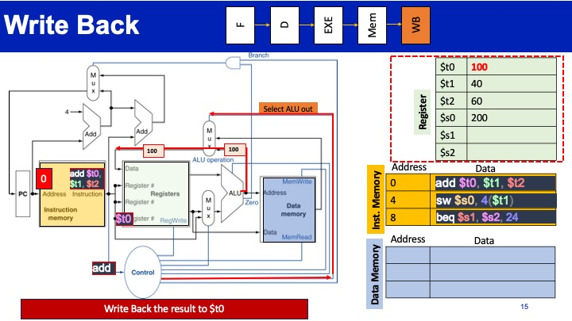

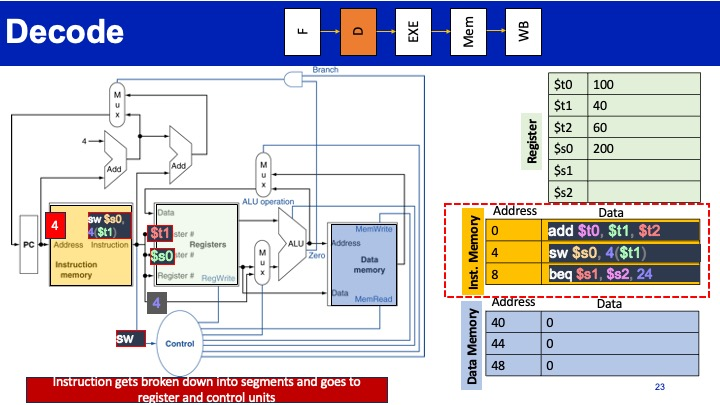

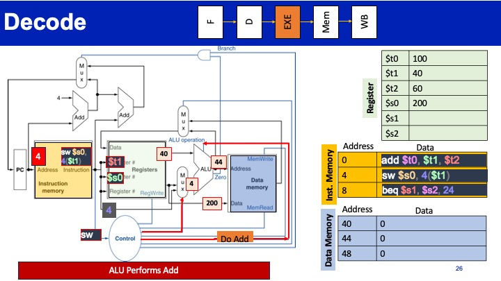

p

---------------
# **Tuesday Feburary 20th**
---------------
# **Memory Technologies and Hierarchy**
---------------
    Store --> Memory
    Load <--- Memory
### Data Storage Technologies/Approaches
* Flip-Flops
    * Very Fast
    * Very Expensive - 46 transistors for a D flip Flop
* Static RAM (SRAM)
    * Fast
    * expensive - 6 transistors per bit
* Dynamic RAM (DRAM)
    * Slow, destructive read
    * Cheap - one transistor + one capacitor per bit
* Flash
    * Very slow, non-volant
    * cheap
* 
### Types of Memories

### Array Organization of Memories
* Components
    * A memory Array
    * Address decoder
    * I/O circutry
* M-bit data can be stored/loaded in/from at each unique N-bit address
    * Addressability: M bits
    * Address space: 2^N unique adresses
### Memory Array Organization
* **Row Decoder**

### Memory Array Folding
* The row decoder uses the address to activate one of the rows by asserting the wordline
* Array is often folded into fewer rows of more columns.Column decode is need to choose between multiple data lines
* 

### Memory Read Example
* 

### DRAM Memory Technology
* Dynamic random-access memory
* Capacitor cahrge state indicates tored value
    * charged 1
    * discharded 0
    * 1 capacitor
    * 1 access transistor
* Capacitor Leaks
    * DRAM cell loses charge over time
    * DRAM cell needs to be refreshed
### Workign of the memory cell
* 

### Read DRAM
* 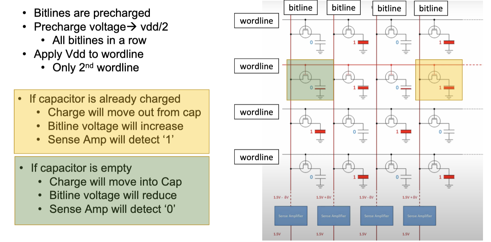
* Read process was desctructive
* It charged/discharged some Cpa
* we must write back after read
    * The correct data is in SA
* Write form SA to impacted row

### SRAM Memory Technology
* 

---------------
# **Thursday Feburary 22nd**
---------------
# **Memory Hierarchy and Address Space**
---------------

### MROM/EPROM/EEPROM
* Mask ROM (MROM)
    * Non programmable read only memory
    * its cheap
* EPROM
    * Erase by using UV light
    * Erasable programmable read-only memory
* EEPROM
    * Electrically erasable programmable read-only memory
    * Can be reprogrammed many times
    8 Can be erased at byte granularity
* All are often used t ostore small read-only code
    * i.e. Boot loader

### Flash Memory
    Two types of flash memory
* NOR Flash ( e.g. S70GL02GT Cypress device)
    * ReadReads at byte granularity
    * Fast random reads (~120ns)
    * slow writes (~520ms to erase 120KB)
    * Lesser density
    * Primarily used as code storage
* NAND Flash (S34ML04G2 Cypress device)
    * Page addressable (e.g., 512 Bytes )
    * Slow random reads (~30us)
    * fast writes (~3.5ms to erase 120KB)
    * Higher density
    * Primarily used as data storage 4
### Solid-State Disk (SSD) / eMMC
* 

### Memory Hierarchy
* 

### Analogy
* the memory hierarch is similar to a library
* this is used to spped up and keep costs low
    * hands = Register 1 book
    * Table = SRAM Up to 4 books
    * Book Trolly = DRAM Up to 8 books
    * Bookshelf = SSD ALL Books
### Why to implement the memory subsystem hierarchy?
    Locality of Reference
* Temporarl locality
    * reference same meory location many times (close together, in time)
* Spatial Locality
    * Reference near neighbors around the same time

### Temporal Locality
* 

###  Spatial Locality
* 

# EXAMPLE QUESTION
Do we need to have a memory hierarchy if CPU is slower than our slowest
memory technology? E.g., if we have a CPU with clock frequency of 1 HZ
and a non-volatile memory with access latency of 0.1 sec. Explain a little bit
##### Answer:
No we do not need memory hieracrhcy because the CPU

# Program Address Space

### Memory Layout of C Programs
    Typical memory representaion of a C program consists of thre broad regions
1. Static Data
    * fixed size, read only, exists for entier program
    * text/code segment
    * intialized data segment
    * unitialized data segment
## Text segment
* containes executable instructions placed below heap or stack in order to prevent overflows
* Often read only

2. Stack
    * variable size
    * grows when alling function
3. Heap
    * variable size
    grows when allocated in program

### Untialized Data Segment
8 contains all global cariables and satci variables that are intialized to zero or do not have explicit intialization source code

### Static Vars
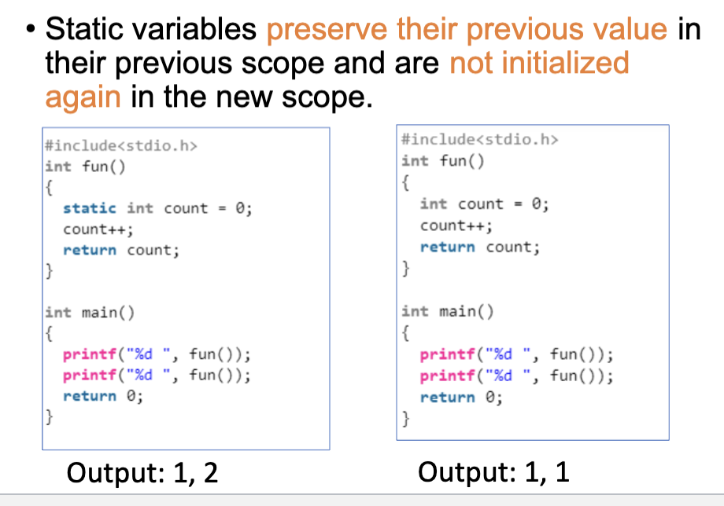

### Stack Example
    this example the bottom of the stack is on the top because that is where the word is

### Heap Example

### Data Memory (Data Segment)

### Memory Map
    CPU's view ofthe physical hardware
* Segregated with multiple regions
* diff memory type for each region
* each platform may have diff mappings

---------------
# **Tuesday March 5th **
---------------
# **Lectuer 11 I/O Interface Part 1 ( NOT ON MIDTERM 1 )**
---------------
### Interfaces
* Two types of interfaces
* **Serial**
    * USB, RS-232 VGA cable, SPI, SATA connections
    * Pros: few pins and wires, high scalability, low power consumption
    * cons: lower bandwidth for the same clock speed
* **Parallel**
    * Parallel ATA (advanced tech attachemnet), SCSI (small computer system inteface), PCI (perihperal component interface (this connects ram and graphics card to the board)
    * Pros: higher bandwith
    * Cons : more pins and wires, low scalability, high power consumption
### Transfer Types
* [transferType.png](transferType.png)

### Synchronous vs. Asynchronous

### Synchronous Transmission
    TX ---Data----> RX
    TX ---Clock----> RX
* **synchronous transmission**
    * requires ocmmon shared clock
    * higher throughput communicaiton
    * low scalability
    * parallel interfaces are usually sync

###  Asynchronous Transmission
    TX ---Data----> RX
* No shared clokc
* Asynchronous start/stop
* Self clocekd, based on transmitted and reciever

### Serial Communication Standard: RS-232
* A 1 is represented by −3 to −25 V
* A 0 is represented by +3 to +25 V
    * Low voltage denotes 1
    * large voltage range makes it less susceptible to noise, interferenace and degredation
* 

### RS232
* The idle state of the RS232 lines is logic 1 (-12V)
* To signal a start condition the line is set logic 0 (+12V) for 1 bit period (please note high voltage means 0).
* Cause a 1 to 0 transition indicates valid data is coming 11
* 

### RS232 Frame Format
* 

### Parity Bit
* used for deteing errors in bits
* Two types: 'even' , 'odd'
* Even Parity: if total number of 1's are even the parity bit value is set to 0. for odd parity its opposite
* 
* the number of ones has to be either even or odd than the last bit will be 1 for even adn 0 for odd if they don't match then there is an error
* the first 0 indicates the start bit then the next 8-bits forms the transmitting frame
### RS-232 Pins
* 

### Universial Asynchronous Reciever/Transmitter (UART)
* Convert parallel content of an 8-bit register t oa bit sequence ready to be transmitted ofver a serioal port
* processor pins -> UART -> volt conversion -> RS232

### System bus diagram in the slides (slide 17)

### UART Speed (Baudrate)
    Both sender adn reciever must use agreed upon transmisison speed (baudrate)
* 
* For a baud rate of 2400 (2400 bps) the frequency is 2400Hz and the bit period is 1/2400 or 416.6us.
* This is the information that a receiver uses to recover the bits from the data stream.

### Question
* Suppose you are sending data over a UART channel at a baud rate of 115200 bps. How long does it take to send a single 8-bit character over the channel?
* Assume 2 stop bit, 1 parity bit, and 1 start bit 19
* ANSWER : 1/115200bps * ( 8 + 2 + 1 + 1)

### Type of Network
* 

### Example of Bus based communication I2C Bus
* 2C is serial and synchronous communication protocol.
* Synchronous -> Uses clock for syncing the data
* Serial -> data line

### I2C Bus Data Protocol
* Data is transferred in sequences of 8 bit
    * bgeings with a start bit
* After start bit, the master provides address of r/w bit
    * It's the address of the slave device
    * R/W denotes if the master wants to read or write
    * 
* After address and R/W bits are sent, Slave returns and ACK bit (acknowledgement)
*  If the ACK is 0slave could not receive the data
* If the Master wants to point to an internal register of the slave device, a second address can be sent
* **start and stop singal**
    * high-to-low SCL is hgh defines a START condition
    * low-to-hgih SCL is high defines STOP

### SPI
    Serial Peripheral Interface
    Synchronous, serial communication protocol
* Uses 4 lines, full-duplex, over 10Mbps
* Single master, multi-slave
* No start/stop bits
* Good for fast, short distance communication, e.g., connecting

### SPI Protocol
* Master shifts out to MOSI (Master Out Slave In) and shifts in from MISO (Master In Slave Out)
* Slave shifts in from MOSI and shifts out to MISO
* 

---------------
# **Lecture 11 Tuesday March 19**
---------------
# **I/O Interface**
---------------

## USB Universal Serial Bus
* Uses "differential signaling" : transmits two signals D+ and D-, where S = D+ - D-
    * reduces noise impact
    * Noise Signal N impacts both D+ and D- in the same wy
    * Gets eliminated: S = (D+ + N) – (D- + N)= D+ – D-
    *

* USB differntial signal moes between differential 1 and differential 0
    * **Differenitial 1** is when the D+ line is high and the D- line is low
    * **Differential 0** is when the D+ line is low and the D- line is high
    *

